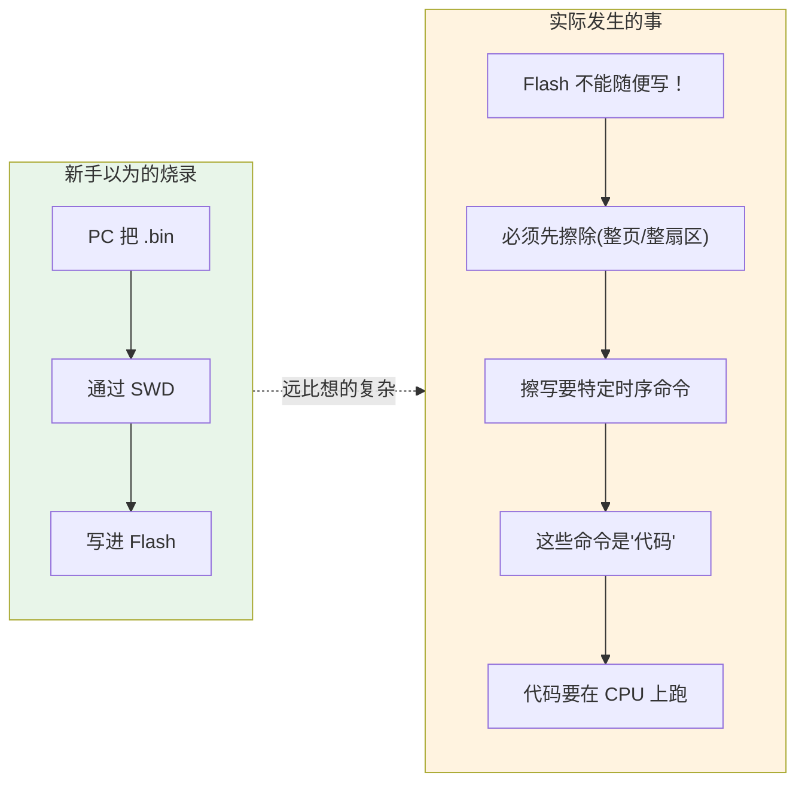
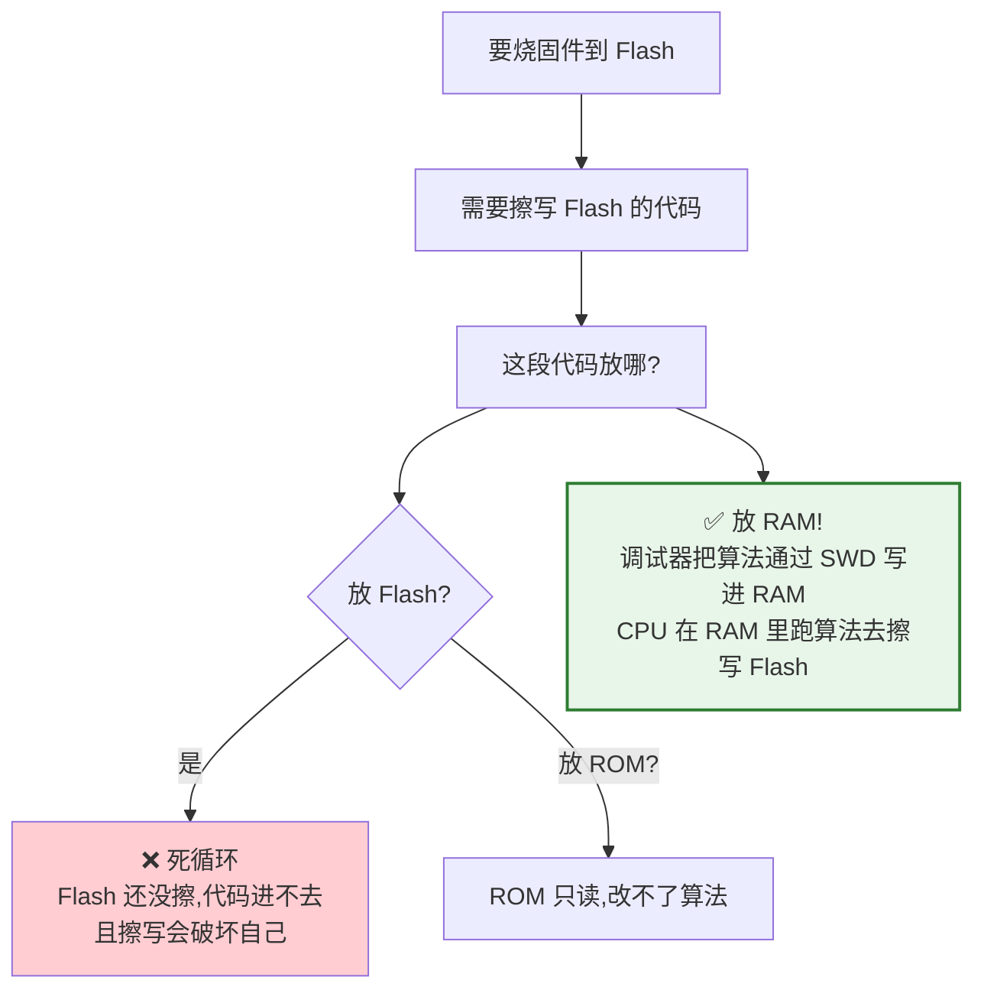
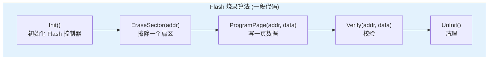
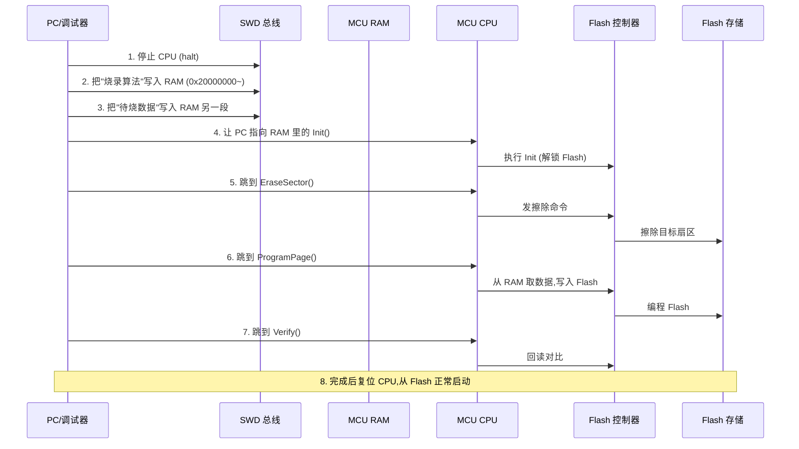
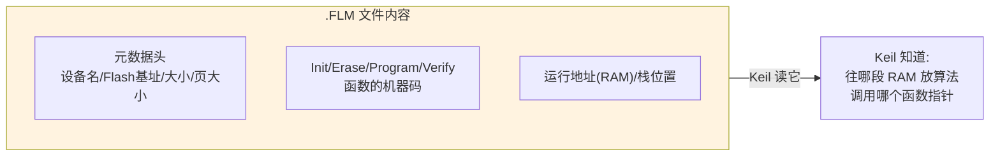
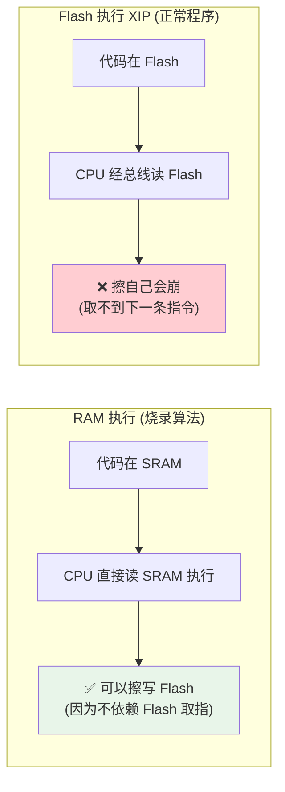
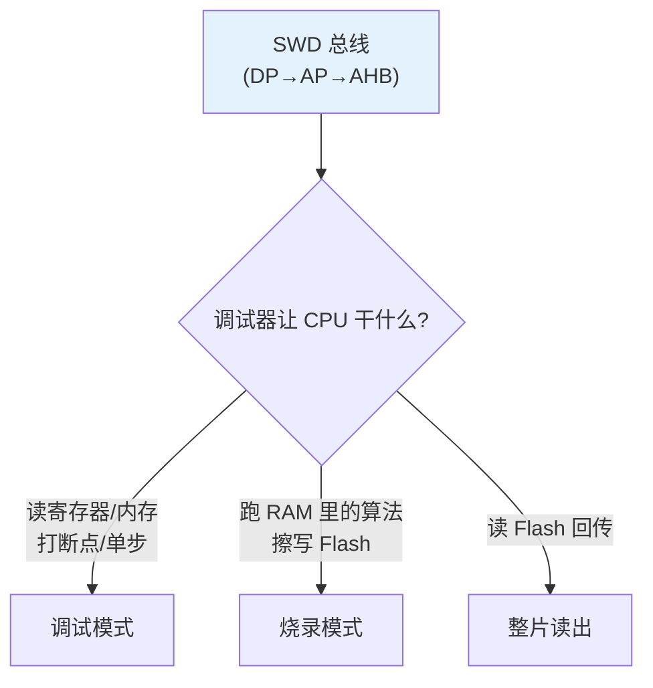

---
aliases:
  - 下载算法
  - Flash 算法
  - FLM
  - Flash Loader
  - 烧录原理
tags:
  - 调试/知识体系
  - 烧录/原理
  - Cortex-M
  - Flash
date: 2026-06-27
status: 🌿草稿
---

> [!abstract] 核心本质
> 烧录看似简单——"把固件写进 Flash"，但藏着一个**鸡生蛋难题**：CPU 执行的代码在 Flash 里，而擦写 Flash 需要一段"擦写算法"，这段算法本身也得先放进去。破局之道是**把擦写算法下载到 RAM 中执行**——CPU 跑 RAM 里的算法，算法再回头擦写 Flash。理解这套机制，你才能看懂 Keil 报错 "No Algorithm found for this device"、看懂 FLM 文件是什么。

---

## 一、鸡生蛋难题：为什么烧录不简单

### 1.1 表面认知 vs 真相



### 1.2 Flash 的物理特性（必须懂）

Flash 和 RAM 的根本区别——**Flash 不能"随便写"**：

| 操作 | RAM | Flash |
|------|-----|-------|
| 读 | 任意地址 | 任意地址 |
| 写 0→1 | 直接写 | ❌ **必须先擦除** |
| 写 1→0 | 直接写 | 可以（有限次） |
| 擦除 | 不需要 | **整页(2KB)/整扇区(16KB)一起擦** |
| 擦写寿命 | 无限 | **~10万次** |

> [!important] 关键约束
> 1. **写前必擦**：Flash 只能把 1 写成 0，要把 0 变回 1 必须擦除
> 2. **擦除粒度大**：不能只擦一个字节，最少擦一整页
> 3. **擦写靠命令**：不是普通内存写，要向 Flash 控制器发**特定时序指令序列**（解锁 → 发命令 → 等完成）

### 1.3 鸡生蛋



> [!tip] 类比：装修队
> 你想翻新一栋楼（擦写 Flash），但施工队（擦写算法）没地方住。让他们住进要翻新的楼里？不行，翻新会毁掉他们的住处。
>
> **解法：搭个临时帐篷（RAM），让施工队住进去，从帐篷出发去翻新大楼。** 这就是"下载算法到 RAM 执行"。

---

## 二、烧录算法：Flash Loader

### 2.1 算法长什么样

烧录算法本质上是一小段代码，提供几个标准函数：



> [!question] 为什么不同芯片要不同算法
> 因为每款 Flash 的**擦写时序命令不同**：
> - STM32F1 的 Flash 控制器命令 ≠ STM32F4
> - STM32F4 要先解锁 KEYR、配并行位数(16/32)、等 BUSY
> - 外挂 SPI Flash（QSPI）又是另一套协议
>
> 所以**每款芯片都有自己的烧录算法**，工具必须选对。

### 2.2 完整烧录流程（RAM 执行）



> [!important] 核心机制
> 烧录期间 **CPU 不是在跑你的程序**，而是在跑**调试器塞进 RAM 的烧录算法**。调试器通过 SWD 不断改 PC 寄存器，控制 CPU 在算法函数之间跳转，并搬运数据。
>
> 这就是为什么烧录时"程序会停"——CPU 被征用了。

---

## 三、FLM 文件：算法的打包格式（Keil 生态）

### 3.1 什么是 FLM

`.FLM`（Flash algorithM）是 **Keil MDK 的烧录算法文件格式**，本质是一段**带元数据的 ELF/bin**：



### 3.2 FLM 工作时

```
Keil 烧录时：
1. 读 .FLM 元数据 → 得知 "算法加载到 RAM 0x20000000，入口在 0x20000021"
2. 通过调试器把算法代码写进 RAM
3. 调用 Init → Erase → Program → Verify（都在 RAM 里执行）
4. 烧完，复位
```

> [!warning] 经典报错："No Algorithm found for this device"
> Keil 找不到匹配你芯片的 FLM 算法。原因：
> 1. 没在 Options → Utilities → Settings 里添加算法
> 2. 选错了芯片型号（F4 的算法调 F1）
> 3. 自定义板用了非标 Flash（需自己写 FLM）

### 3.3 其他工具的等价物

| 工具 | 算法来源 | 格式 |
|------|---------|------|
| **Keil MDK** | FLM 文件 | 打包 ELF |
| **STM32CubeProgrammer** | 内置各型号算法 | 闭源 |
| **OpenOCD** | `target/*.cfg` 配置里的算法 | C 数组 |
| **esptool (ESP32)** | ROM Bootloader 已固化 | 不需要外部算法 |

> [!tip] ESP32 为什么不需要烧录算法
> ESP32 的 **ROM 里固化了一级 Bootloader**（见 [[ESP32-D0WDQ6的启动流程和内存详细]]），里面已包含 Flash 擦写代码。esptool 只需通过 UART/USB 把数据发给 ROM Bootloader，Bootloader 自己擦写。**所以 ESP32 永远不会"找不到算法"。**

---

## 四、RAM 执行 vs Flash 执行（XIP）

烧录算法在 RAM 跑，而正常程序在 Flash 跑（XIP，eXecute In Place）。理解差异：



> [!danger] 为什么不能在 Flash 里跑擦除代码
> 如果"擦除函数"本身在 Flash 的 A 扇区，擦除 A 扇区时，CPU 取下一条指令就取不到了（A 正在被擦）→ 跑飞。
>
> 这就是**擦写算法必须在 RAM** 的根本原因：解耦"执行"和"被擦的对象"。

---

## 五、烧录与调试的统一

烧录和调试用的是**同一条 SWD 物理链路**，区别只在"调试器让 CPU 干什么"：



> [!abstract] 统一洞察
> 调试和烧录**没有本质区别**，都是"通过 SWD 控制 CPU + 访问内存"。烧录只是"让 CPU 跑一段特定的内存操作算法"。所以 ST-Link 既能调试也能烧录，OpenOCD 既能 `monitor halt` 也能 `flash write_image`。

---

## 六、特殊烧录场景

### 6.1 Option Byte / 选项字节

STM32 有一组特殊配置寄存器（Option Byte），控制：读写保护、看门狗硬件启动、BOOT 配置。它们也是 Flash，但**单独的扇区**，需用专用命令擦写：

```bash
# STM32CubeProgrammer 设置读保护级别
STM32_Programmer_CLI -c port=swd -ob RDP=0xAA
```

> [!warning] 读保护 RDP
> 设置 RDP（Read Out Protection）后，SWD 读不出 Flash（防抄板）。**解除 RDP 会全片擦除**！别误操作。

### 6.2 OTP（一次性可编程）

部分芯片有 OTP 区，**只能写一次**，常存 MAC 地址、序列号。烧录 OTP 要格外小心——写错无法挽回。

### 6.3 双区烧录 / OTA

支持 OTA 的固件分 A/B 两区。Bootloader 先写 B 区，校验通过后切换启动区。本质仍是"RAM 跑算法擦写 Flash"，只是算法在**用户 Bootloader 里**而非调试器塞入。

---

## 七、避坑清单

> [!warning] 烧录原理相关坑
> 1. **"No Algorithm found"** — Keil 没加 FLM 或选错芯片，在 Utilities 里配
> 2. **烧录到一半断电** — Flash 可能处于半擦半写状态，需整片擦除重烧
> 3. **擦写时访问 Flash** — 代码里擦写 Flash 期间不能读同片 Flash（取指/查表都会卡）
> 4. **Flash 等待周期没配** — F103 烧录后不运行，常因 `FLASH->ACR` Latency 没设（CPU 比 Flash 快）
> 5. **RDP 读保护锁死** — ST-Link Utility → Option Bytes → 取消，但会全片擦
> 6. **Option Byte 改了不生效** — 改完要**重新上电**（不是复位），部分 OB 需掉电才加载

---

## 🔗 知识延伸

- ⬆️ **上位知识**：[[_MOC-开发流水线总览]]、[[调试全景数据流]]（烧录是 SWD 链路的应用）
- ➡️ **平级关联**：[[烧录工具与命令]]（算法怎么被调用）、[[ISP与救砖]]（无调试器时靠 ROM Bootloader）、[[文件格式]]（烧的是 elf/hex/bin）
- ⬇️ **下位知识**：FLM 文件编写、STM32 Flash 控制器寄存器（KEYR/SR/CR）、QSPI Flash 烧录、OTA 分区设计
