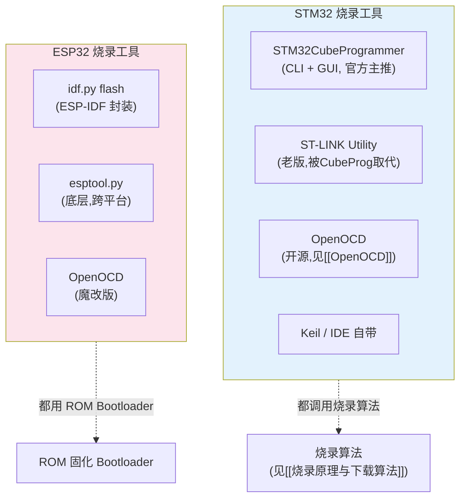
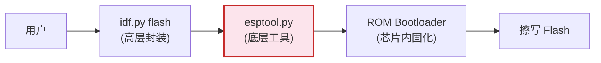
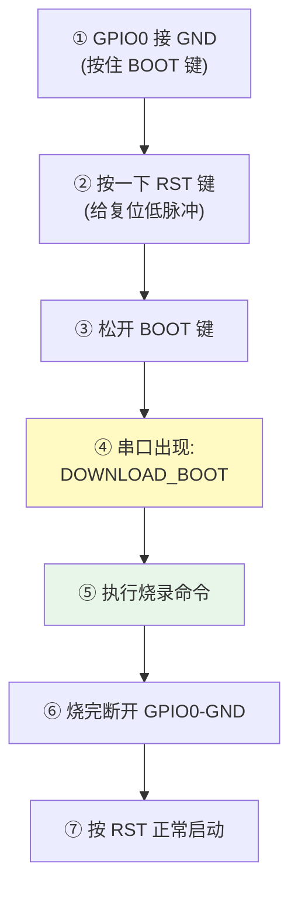

---
aliases:
  - 烧录工具
  - STM32CubeProgrammer
  - esptool
  - 烧录命令
  - ST-LINK Utility
tags:
  - 调试/知识体系
  - 烧录/工具
  - STM32
  - ESP32
date: 2026-06-27
status: 🌿草稿
---

> [!abstract] 核心本质
> 烧录工具是「**烧录算法的调用者 + 数据的搬运工**」。无论 GUI 还是命令行，它们做的都是三件事：**连接芯片 → 触发算法擦写 → 校验复位**。掌握命令行工具（STM32CubeProgrammer CLI / esptool）比依赖 GUI 更重要——因为 CI/CD 自动化、量产脚本、报错排查都靠命令行。本篇是 STM32 + ESP32 的命令实战手册。

---

## 一、烧录工具全景



> [!tip] 为什么要学 CLI
> GUI 点几下看似方便，但：
> - **CI 自动化烧录**：必须用命令行
> - **量产脚本**：工厂要可重复的脚本
> - **报错诊断**：CLI 输出更详细
> - **远程/无头环境**：没 GUI
>
> 会 CLI = 真懂烧录。

---

## 二、STM32CubeProgrammer CLI（STM32 官方）

### 2.1 连接方式

STM32CubeProgrammer（简称 CubeProg）支持三种连接：

| 接口 | 命令参数 | 场景 |
|------|---------|------|
| **SWD** | `-c port=swd` | ST-Link 调试器，最常用 |
| **JTAG** | `-c port=jtag` | JTAG 调试器 |
| **UART** | `-c port=COM3 br=115200` | System Memory ISP 模式（见 [[ISP与救砖]]） |
| **USB-DFU** | `-c port=usb` | 芯片内置 DFU 模式 |

### 2.2 核心命令速查

```bash
# ============ 连接 + 信息 ============
# 列出已连接的探针
STM32_Programmer_CLI -l

# 连接并读芯片信息（芯片型号/Flash大小/UID）
STM32_Programmer_CLI -c port=swd

# ============ 烧录 ============
# 烧录 hex（hex 自带地址，最安全）
STM32_Programmer_CLI -c port=swd -w firmware.hex -v

# 烧录 bin（必须指定地址！STM32 主 Flash = 0x08000000）
STM32_Programmer_CLI -c port=swd -w firmware.bin 0x08000000 -v

# 烧录 elf（带符号，调试用）
STM32_Programmer_CLI -c port=swd -w firmware.elf -v

# ============ 擦除 ============
# 全片擦除
STM32_Programmer_CLI -c port=swd -e all

# 擦除指定扇区
STM32_Programmer_CLI -c port=swd -e [0 3 7-10]

# ============ 读出 / 校验 ============
# 读出整个 Flash 到文件（备份固件）
STM32_Programmer_CLI -c port=swd -r 0x08000000 0x100000 backup.bin

# 仅校验（不烧录）
STM32_Programmer_CLI -c port=swd -v firmware.bin 0x08000000

# ============ 运行控制 ============
# 烧录后立即复位运行
STM32_Programmer_CLI -c port=swd -w firmware.hex -v -rst

# 仅复位（不烧录）
STM32_Programmer_CLI -c port=swd -rst

# ============ Option Byte（选项字节）============
# 读 Option Byte
STM32_Programmer_CLI -c port=swd -ob displ

# 设置读保护（防抄板，慎用！解除会全片擦）
STM32_Programmer_CLI -c port=swd -ob RDP=0xBB

# 解除读保护（会全片擦除！）
STM32_Programmer_CLI -c port=swd -ob RDP=0xAA

# 设置 BOOT0（部分芯片可软配）
STM32_Programmer_CLI -c port=swd -ob BOOT0=1
```

### 2.3 关键参数详解

| 参数 | 含义 | 备注 |
|------|------|------|
| `-c port=swd` | 连接方式 | swd/jtag/COMx/usb |
| `-c index=N` | 多探针时选第 N 个 | 配合 `-l` 查列表 |
| `-w <file> [addr]` | 烧录 | bin 必须带地址，hex/elf 可省 |
| `-v [file] [addr]` | 校验 | 烧后必校验！ |
| `-e all` / `-e [list]` | 擦除 | all 全片 / 指定扇区 |
| `-r addr size file` | 读出 | 备份/取证 |
| `-rst` | 复位 | 烧完让它跑起来 |
| `-ob` | Option Byte 操作 | 读写保护/BOOT配置 |
| `-el <stldr>` | 加载外部算法 | 外挂 Flash 时用 |

> [!warning] bin 必须带地址
> `.bin` 是纯字节流（见 [[文件格式]]），没有地址信息。烧 bin **必须**指定目标地址。忘加地址会烧到 0x00000000，芯片跑飞。

### 2.4 多探针环境

```bash
# 1. 列出所有探针，拿到序号/SN
STM32_Programmer_CLI -l
# 输出：
#   ------- Connected ST-LINK probes list -------
#   ST-LINK SN  : 48FF6A067788...
#   ST-LINK SN  : 066EFF515554...

# 2. 用 SN 指定
STM32_Programmer_CLI -c port=swd serial=48FF6A067788 -w fw.hex
```

---

## 三、量产烧录流程（推荐模板）


### 量产脚本（PowerShell 示例）

```powershell
# flash-production.ps1 — 量产烧录脚本
$cli = "C:\Program Files\STMicroelectronics\STM32Cube\STM32CubeProgrammer\bin\STM32_Programmer_CLI.exe"
$fw = ".\firmware.hex"

# 1. 检测设备
& $cli -l | Select-String "ST-LINK SN"
if (-not $?) { throw "未检测到 ST-LINK" }

# 2. 擦除 + 烧录 + 校验 + 复位（一条命令）
& $cli -c port=swd -e all -w $fw -v -rst
if ($LASTEXITCODE -ne 0) { throw "烧录失败" }

Write-Host "✅ 烧录成功" -ForegroundColor Green
```

> [!tip] 量产黄金组合：擦+烧+校+复位
> `-e all -w fw.hex -v -rst` 一条命令搞定。**务必带 `-v`**——校验能抓出"看似烧成功实则数据错"的隐患（接触不良、Flash 坏块）。

---

## 四、esptool.py（ESP32 底层工具）

### 4.1 esptool 在 ESP32 链路中的位置



> [!important] ESP32 与 STM32 的根本差异
> - STM32 烧录要**外部烧录算法**（FLM / CubeProg 内置）
> - ESP32 的**ROM 已固化 Bootloader**，含擦写算法 → esptool 只需喂数据
>
> 所以 ESP32 永远不会"找不到算法"，任何 esptool 版本都能烧任何 ESP32。

### 4.2 核心命令

```bash
# ============ 信息查询 ============
# 读芯片 ID（型号/版本）
esptool.py -p COM3 chip_id

# 读 Flash 信息（容量/厂商）
esptool.py -p COM3 flash_id

# ============ 烧录（最常用）============
# 烧录到指定地址
esptool.py -p COM3 write_flash 0x10000 app.bin

# 烧录多个文件（ESP32 标准三件套）
esptool.py -p COM3 write_flash \
    0x1000   bootloader.bin \
    0x8000   partitions.bin \
    0x10000  app.bin

# 指定 Flash 参数（首次/换板时）
esptool.py -p COM3 --chip esp32 \
    write_flash -fs 4MB -fm dio -ff 40m \
    0x1000 bootloader.bin ...

# ============ 擦除 ============
# 全片擦除
esptool.py -p COM3 erase_flash

# 擦除指定区域
esptool.py -p COM3 erase_region 0x310000 0x100000

# ============ 读出 / 校验 ============
# 读 Flash 到文件
esptool.py -p COM3 read_flash 0x00000 0x400000 backup.bin

# 校验
esptool.py -p COM3 verify_flash 0x10000 app.bin

# ============ 速度 ============
# 提高波特率加速（默认 460800）
esptool.py -p COM3 -b 921600 write_flash 0x10000 app.bin
```

### 4.3 ESP32 烧录地址（必背）

| 文件 | 烧录地址 | 说明 |
|------|---------|------|
| `bootloader.bin` | **0x1000** | 二级引导 |
| `partitions.bin` | **0x8000** | 分区表 |
| `app.bin` | **0x10000** | 应用固件 |
| `boot_app0.bin` | 0xe000 | OTA 数据（用 OTA 时） |

> [!warning] 地址写错会覆盖
> ESP32 的 bootloader 在 0x1000，若误把 app 烧到 0x1000，**bootloader 被覆盖**，芯片启动直接死。救法见 [[ISP与救砖]]。

### 4.4 idf.py 封装（推荐日常用）

```bash
# 一条龙：编译 + 烧录 + 监视
idf.py -p COM3 flash monitor

# 等价于底层
idf.py build
esptool.py -p COM3 write_flash @flash_args   # @flash_args 自动含地址和文件
```

> [!tip] flash_args 的妙用
> `build/flash_args` 是构建生成的文件，记录了所有烧录地址和文件。`esptool.py @flash_args` 一键烧全部，不用手敲地址。CI 自动化常用。

---

## 五、ESP32-CAM 手动进下载模式

ESP32-CAM 多数没有 auto-reset 电路，需手动进下载模式：



---

## 六、STM32 vs ESP32 烧录对比

| 维度 | STM32 | ESP32 |
|------|-------|-------|
| **主工具** | STM32CubeProgrammer | esptool.py / idf.py |
| **连接** | SWD（调试器） | UART/USB（直连） |
| **需要调试器？** | ✅ 需要 ST-Link | ❌ 一个 USB-TTL 即可 |
| **算法来源** | 外部（FLM/CubeProg内置） | ROM 固化 |
| **烧录地址** | 0x08000000（主Flash） | 三件套（0x1000/0x8000/0x10000） |
| **擦写时 CPU** | 被调试器征用跑算法 | ROM Bootloader 接管 |
| **GUI** | CubeProg GUI | ESP-Flash-Tool（第三方） |
| **量产** | CubeProg CLI 脚本 | esptool + flash_args |

---

## 七、避坑清单

> [!warning] 烧录工具常见坑
> 1. **bin 没带地址** — STM32 烧到 0x00000000 跑飞；ESP32 覆盖 bootloader
> 2. **没校验就量产** — 接触不良导致数据错，务必 `-v` / `verify_flash`
> 3. **波特率过高失败** — ESP32 921600 在劣质 USB-TTL 上不稳，降到 460800
> 4. **多探针选错** — STM32 用 `serial=SN`，ESP32 用 `-p COMx` 区分
> 5. **Flash 模式/频率配错** — ESP32 `-fm dio -ff 40m` 要与板子 Flash 型号匹配
> 6. **Option Byte 改了没掉电** — 部分 OB 需重新上电（非复位）才加载
> 7. **ST-LINK 固件太旧** — 升级 ST-Link 固件后再用新版 CubeProg

---

## 🔗 知识延伸

- ⬆️ **上位知识**：[[_MOC-开发流水线总览]]、[[烧录原理与下载算法]]（工具在调用算法）
- ➡️ **平级关联**：[[ISP与救砖]]（无调试器的烧录方式）、[[文件格式]]（烧的是什么）、[[配置文件链路]]（IDE 怎么调用这些工具）、[[基础指令]]（idf.py 全套命令）
- ⬇️ **下位知识**：STM32 Option Byte 详解、ESP32 分区表 CSV、QSPI 外挂 Flash 烧录、Secure Boot 签名烧录
