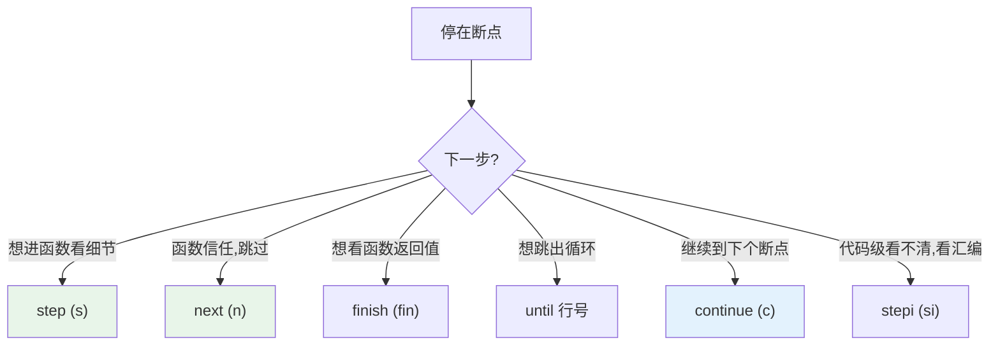

---
aliases:
  - GDB
  - GDB 命令
  - arm-none-eabi-gdb
  - 调试命令
tags:
  - 调试/知识体系
  - 调试/工具
  - GDB
date: 2026-06-25
status: 🌿草稿
---

> [!abstract] 核心本质
> GDB 是调试链路的**前端指挥官**：它不直接碰硬件，而是通过 GDB Remote 协议向 GDB Server（OpenOCD / ST-LINK GDB Server）下达命令。你下的每个 `break`、`print`，最终都变成 SWD 总线上的内存读写。这篇是命令速查 + 实战场景手册。

---

## 一、GDB 在嵌入式中的角色


> [!important] 嵌入式 GDB 的特殊之处
> 桌面 GDB 直接控制本机进程；嵌入式 GDB 是 **`target remote`** 远程模式——它连的是另一台"机器"（MCU），中间隔着 GDB Server。
>
> 所以嵌入式调试必须先**连接**（`target remote`），才能下命令。

---

## 二、启动与连接

### 2.1 基本启动

```bash
# 启动并加载符号（必须有带 -g 的 .elf）
arm-none-eabi-gdb build/Debug/firmware.elf

# 一步到位：启动 + 连接 OpenOCD
arm-none-eabi-gdb build/Debug/firmware.elf \
    -ex "target remote :3333"
```

### 2.2 连接到已运行的 GDB Server

```gdb
(gdb) target remote localhost:3333     # OpenOCD
(gdb) target remote localhost:61234    # ST-LINK GDB Server 默认端口
(gdb) target extended-remote :3333     # 支持断开重连
```

### 2.3 加载固件到 MCU

```gdb
(gdb) load                    # 把 ELF 烧进 Flash（GDB Server 负责）
(gdb) monitor reset halt      # 复位并暂停（monitor 命令转发给 Server）
```

> [!tip] `monitor` 是什么
> `monitor xxx` = 把命令**透传给 GDB Server**（OpenOCD/ST-Link），不是 GDB 本身的功能。如 `monitor reset`、`monitor swj_dp` 都发给底层 Server 处理。

---

## 三、断点类命令（最常用）

| 命令 | 缩写 | 作用 |
|------|------|------|
| `break main` | `b main` | 函数处设断点 |
| `break file.c:42` | `b file.c:42` | 指定文件行号设断点 |
| `break *0x08000100` | `b *0x...` | 指定**地址**设断点（HardFault 定位用） |
| `tbreak main` | `tb` | 临时断点（命中一次后自动删除） |
| `rbreak ^task_` | - | 用正则批量设断点（所有 task_ 开头函数） |
| `info breakpoints` | `i b` | 查看所有断点 |
| `delete 2` | `d 2` | 删除 2 号断点 |
| `delete` | `d` | 删除所有断点 |
| `disable 1` | `dis 1` | 禁用（不删） |
| `enable 1` | `en 1` | 启用 |
| `ignore 1 5` | - | 1 号断点忽略前 5 次命中 |
| `condition 1 x==10` | `cond 1 x==10` | 条件断点（x==10 才停） |

### 数据断点（观察点，定位变量被篡改）

```gdb
(gdb) watch motor_speed        # 写入时暂停
(gdb) rwatch counter           # 读取时暂停
(gdb) awatch flag              # 读或写都暂停
```

> [!warning] 观察点数量有限
> 数据断点用 Cortex-M 的 **DWT 单元**，通常只有 **2-4 个**（见 [[Cortex-M4 核心寄存器与调用栈]]）。超了会报错。

---

## 四、执行控制类命令

| 命令 | 缩写 | 作用 |
|------|------|------|
| `continue` | `c` | 继续运行到下个断点 |
| `step` | `s` | 单步**进入**函数 |
| `next` | `n` | 单步**跳过**函数（把函数当一行） |
| `finish` | `fin` | 运行到当前函数**返回** |
| `until` | `u` | 运行到指定行（跳出 for 循环利器） |
| `stepi` | `si` | 单步**一条汇编指令**（进入） |
| `nexti` | `ni` | 单步一条汇编（跳过） |
| `jump *0x08001234` | `j` | 强制跳转到地址（慎用） |



---

## 五、状态查看类命令

### 5.1 变量查看

```gdb
(gdb) print x              # p x，看变量
(gdb) print/x x            # 十六进制
(gdb) print *ptr           # 解引用指针
(gdb) print arr[0]@5       # 看数组前5个元素
(gdb) print motor.speed    # 看结构体成员
(gdb) display x            # 每次停下自动显示 x
(gdb) info locals          # 当前函数所有局部变量
(gdb) info args            # 函数参数
```

### 5.2 调用栈（崩溃定位核心）

```gdb
(gdb) backtrace            # bt，查看调用栈
(gdb) bt full              # 带局部变量的调用栈
(gdb) frame 2              # f 2，切到第 2 层栈帧
(gdb) up / down            # 上/下移一层栈帧
```

```
(gdb) bt
#0  func_C () at main.c:25          ← 当前停在 func_C
#1  0x08001234 in func_B () at main.c:18
#2  0x08001100 in func_A () at main.c:10
#3  0x08001000 in main () at main.c:5
```

### 5.3 寄存器与内存（底层排查）

```gdb
(gdb) info registers       # i r，看所有寄存器
(gdb) info registers pc lr sp   # 只看关键三个
(gdb) x/16xw 0x20000000    # 内存: 16个字, 十六进制, 从0x20000000
(gdb) x/8cb 0x08001000     # 8字节当字符看
(gdb) x/i 0x08000100       # 当指令反汇编
(gdb) disassemble main     # 反汇编整个函数
(gdb) disassemble /m main  # 混合源码+汇编(调试优化代码神器)
```

> [!tip] x 命令格式：`x/NFx`
> - **N** = 数量，**F** = 格式(x十六进制/d十进制/c字符/i指令)，**U** = 单位(b字节/w字/g八字节)
> - 例：`x/16xw` = 16 个、十六进制、字(4字节)

---

## 六、.gdbinit 自动化

在项目根目录放 `.gdbinit`，GDB 启动时自动执行：

```gdb
# .gdbinit
set print pretty on              # 结构体美观打印
set print array on
set disassembly-flavor intel     # 汇编用 Intel 语法
set output-radix 16              # 默认十六进制

# 连接 + 烧录 + 重置一条龙
target remote :3333
monitor reset halt
load
break main
continue
```

> [!warning] .gdbinit 安全限制
> 新版 GDB 默认拒绝执行非 home 目录的 `.gdbinit`。要么放 `~/.gdbinit`，要么在 `~/.gdbinit` 加 `add-auto-load-safe-path /你的项目/`。

---

## 七、实战场景速查

### 场景 1：调试某个函数

```gdb
(gdb) b motor_control
(gdb) c
# 命中后
(gdb) n          # 逐行
(gdb) p speed    # 看变量
(gdb) fin        # 看返回值
```

### 场景 2：变量被意外修改（数据断点）

```gdb
(gdb) watch global_flag
(gdb) c
# 谁改了 flag 就停 → 抓到真凶
(gdb) bt         # 看是谁改的
```

### 场景 3：HardFault 崩溃定位

```gdb
# 程序死在 HardFault_Handler
(gdb) bt                 # 看调用栈（可能不准，因为异常）
(gdb) x/8xw $sp          # 看压栈的寄存器
# 栈里偏移 24 就是崩溃时的 PC（见 Cortex-M4 笔记）
(gdb) x/i 0x0800xxxx     # 反汇编那个地址 → 定位崩溃指令
```

### 场景 4：Release 优化代码调试

```gdb
(gdb) disassemble /m func   # 源码+汇编对照，看变量怎么被优化
(gdb) info registers        # 优化后变量在寄存器里，不在内存
(gdb) p/x $r0               # 直接看寄存器
```

---

## 八、命令速查表

| 类别 | 命令 | 说明 |
|------|------|------|
| 连接 | `target remote :3333` | 连 GDB Server |
| | `load` | 烧录 |
| | `monitor reset halt` | 复位暂停 |
| 断点 | `b main` / `b file.c:42` | 函数/行 |
| | `watch var` | 数据断点 |
| | `cond 1 x>10` | 条件 |
| 执行 | `c` / `s` / `n` / `fin` | 继续/单步入/单步跳/到返回 |
| 查看 | `p x` / `i locals` / `bt` | 变量/局部/调用栈 |
| 底层 | `i r` / `x/16xw addr` | 寄存器/内存 |
| | `disassemble /m func` | 源码+汇编 |

---

## 九、避坑清单

> [!warning] GDB 调试常见坑
> 1. **符号文件不匹配** — ELF 和烧进芯片的固件不一致，断点乱跳（见 [[调试全景数据流]] 黄金法则）
> 2. **优化导致变量消失** — `-O2` 下 `p x` 报 "optimized out"，用 `-Og` 或单文件关优化
> 3. **断点打在库函数** — 半导体库代码很多，误断会卡；用 `disable` 暂关
> 4. **硬件断点超限** — Flash 只读区断点用 FPB（仅 6 个），超了报 "Too many breakpoints"
> 5. **断开后重连** — 用 `target extended-remote` 而非 `remote`，支持反复断开
> 6. **`monitor` 命令因 Server 而异** — OpenOCD 和 ST-Link Server 的 monitor 命令不同，别混用

---

## 🔗 知识延伸

- ⬆️ **上位知识**：[[_MOC-开发流水线总览]]、[[调试全景数据流]]（GDB 是五层模型的前端层）
- ➡️ **平级关联**：[[OpenOCD]]（GDB 连的 Server）、[[探针对比]]、[[SWD与JTAG协议]]
- ⬇️ **下位知识**：[[HardFault排查实战]]、[[ESP32调试]]（`idf.py gdb` 封装）、GDB Python 脚本
