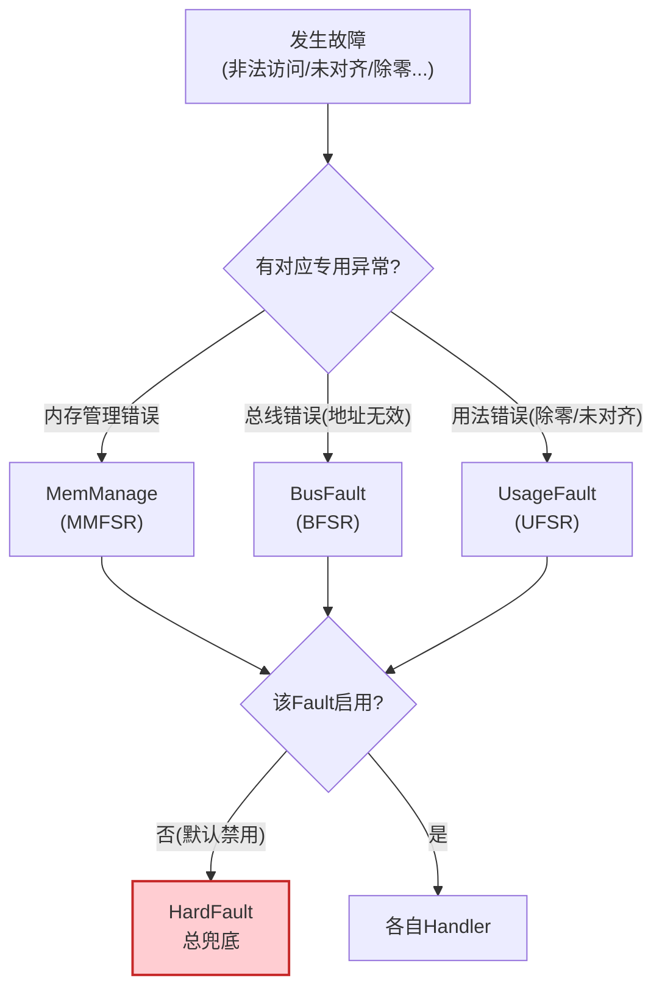
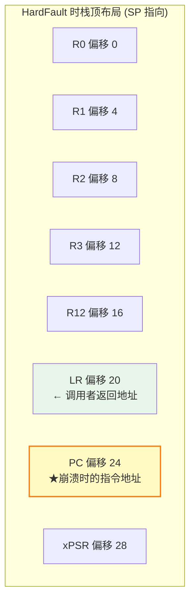
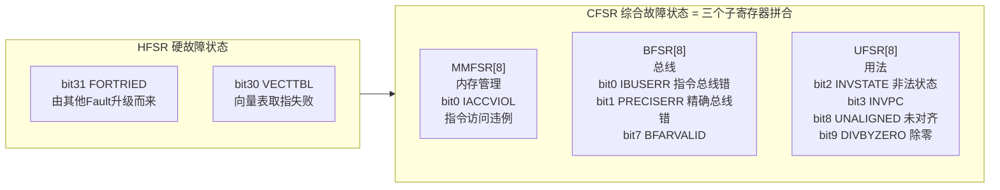
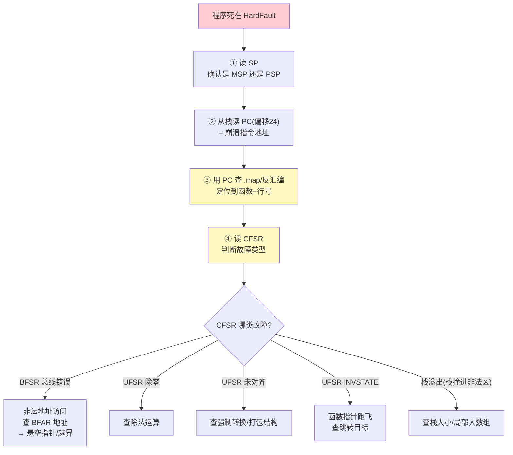
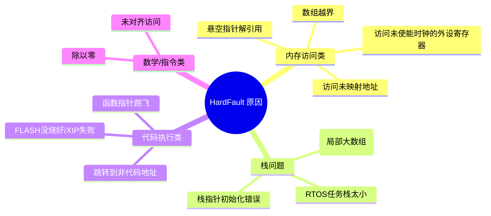

---
aliases:
  - HardFault
  - 故障排查
  - CFSR HFSR
  - 崩溃定位
tags:
  - 调试/知识体系
  - 调试/实战
  - Cortex-M
date: 2026-06-25
status: 🌿草稿
---

> [!abstract] 核心本质
> HardFault 是 Cortex-M 的"**总故障兜底异常**"：当内存访问非法、指令执行出错、栈溢出等任何故障未被更具体的异常处理时，CPU 就跳进 HardFault_Handler 停尸。排查的核心是**两件事**：① 从栈里抓出崩溃瞬间的 PC（"案发地点"）；② 从故障寄存器 CFSR/HFSR 读出故障类型（"案发性质"）。

---

## 一、HardFault 在异常体系中的位置



> [!important] 为什么总是 HardFault
> MemManage/BusFault/UsageFault **默认是关闭的**。所有本该它们处理的错误，最终都"升级"成 **HardFault**。所以你看到的崩溃几乎都是 HardFault——它是故障的**最终汇聚点**。

---

## 二、崩溃瞬间的现场：栈里藏着"案发地点"

当 HardFault 触发，硬件**自动压栈 8 个寄存器**到当前栈（MSP 或 PSP）：



> [!tip] 关键
> **栈里偏移 24 的那个值 = 崩溃瞬间正在执行的指令地址。** 这就是"案发地点"。拿它在 `.map` 或反汇编里一查，立刻知道崩在哪个函数的哪一行。

---

## 三、故障状态寄存器：读出"案发性质"

光知道崩在哪还不够，还要知道**为什么崩**。Cortex-M 提供一组故障寄存器：



### 3.1 HFSR（HardFault Status Register）@ 0xE000ED2C

| 位 | 名称 | 含义 |
|----|------|------|
| 31 | **FORTRIED** | =1 表示由 BusFault/MemManage/UsageFault 升级而来（最常见！此时去查 CFSR） |
| 30 | VECTTBL | 向量表读取失败（向量表地址配错） |

### 3.2 CFSR（Configurable Fault Status Register）@ 0xE000ED28

CFSR 是 32 位，由 **MMFSR(低8) + BFSR(中8) + UFSR(高8)** 拼成。

| 子寄存器 | 关键位 | 含义（置1表示触发了该故障） |
|---------|--------|--------------------------|
| **BFSR** | bit1 PRECISERR | 精确总线错误（**地址非法**，最常见！查 BFAR） |
| | bit7 BFARVALID | =1 时 BFAR(0xE000ED38) 存有效故障地址 |
| **UFSR** | bit2 INVSTATE | 执行了 EPSR.T=0 的指令（函数指针跑飞） |
| | bit8 UNALIGNED | 未对齐访问 |
| | bit9 DIVBYZERO | 除以零 |
| **MMFSR** | bit0 IACCVIOL | 指令访问违例（XN 区执行） |

> [!abstract] 解读口诀
> 1. HFSR.FORTRIED=1 → 去 CFSR 找根因
> 2. CFSR 看 BFSR/UFSR/MMFSR 哪个 bit 置位
> 3. BFSR.PRECISERR=1 → 看 BFAR 寄存器（**哪个地址访问非法**）

---

## 四、完整定位流程（决策树）



---

## 五、实战：HardFault_Handler 提取现场

### 5.1 基础版（裸寄存器读取）

```c
void HardFault_Handler(void) {
    uint32_t *sp;
    __asm volatile ("MRS %0, MSP" : "=r"(sp));  // 读主栈指针

    uint32_t r0  = sp[0];
    uint32_t r1  = sp[1];
    uint32_t r2  = sp[2];
    uint32_t r3  = sp[3];
    uint32_t r12 = sp[4];
    uint32_t lr  = sp[5];   // 调用者返回地址
    uint32_t pc  = sp[6];   // ★崩溃指令地址
    uint32_t psr = sp[7];

    // 故障寄存器
    volatile uint32_t cfsr = *(volatile uint32_t *)0xE000ED28;
    volatile uint32_t hfsr = *(volatile uint32_t *)0xE000ED2C;
    volatile uint32_t bfar = *(volatile uint32_t *)0xE000ED38;

    printf("HardFault!\n");
    printf("PC  = 0x%08X  ← 用此值查 map\n", pc);
    printf("LR  = 0x%08X\n", lr);
    printf("CFSR= 0x%08X  HFSR=0x%08X\n", cfsr, hfsr);
    if (cfsr & 0x8000) printf("BFAR= 0x%08X (非法地址)\n", bfar);

    while(1);  // 死等调试器连接
}
```

### 5.2 进阶版（自动判断 MSP/PSP）

```c
void HardFault_Handler(void) {
    uint32_t *sp;
    uint32_t lr_exc;
    __asm volatile ("MRS %0, LR" : "=r"(lr_exc));  // 读 EXC_RETURN

    // EXC_RETURN bit2: 0=MSP, 1=PSP
    if (lr_exc & 0x04) {
        __asm volatile ("MRS %0, PSP" : "=r"(sp));  // 线程栈
    } else {
        __asm volatile ("MRS %0, MSP" : "=r"(sp));  // 主栈
    }
    // ... 继续读 sp[0..7]
}
```

> [!tip] 为什么要判断 MSP/PSP
> 中断可能发生在**线程态（用 PSP）**或 **Handler 态之前已在 Handler（用 MSP）**。读错栈指针，PC 就完全不对。

---

## 六、GDB 下的 HardFault 排查

不用 printf，直接用 GDB 抓现场更高效：

```gdb
# 程序死在 HardFault_Handler 时
(gdb) bt                       # 调用栈（异常栈可能不准）
(gdb) info registers lr        # EXC_RETURN，判断 MSP/PSP
(gdb) x/8xw $sp                # 栈顶 8 个寄存器
# 第 7 个(偏移24) = 崩溃 PC
(gdb) x/i 0x0800xxxx           # 反汇编那个地址 → 定位函数
```

### 直接读故障寄存器

```gdb
(gdb) x/xw 0xE000ED28          # CFSR
(gdb) x/xw 0xE000ED2C          # HFSR
(gdb) x/xw 0xE000ED38          # BFAR
```

---

## 七、常见 HardFault 原因分类与修复



| 现象(CFSR) | 根因 | 修复 |
|-----------|------|------|
| BFSR.PRECISERR + BFAR 指向随机地址 | 悬空指针/越界 | 检查指针有效性、数组边界 |
| BFSR.IBUSERR，PC 在 0x00000000 或随机 | 函数指针未初始化 | 函数指针赋默认值 |
| UFSR.DIVBYZERO | 除法分母为 0 | 除前检查分母 |
| UFSR.UNALIGNED | `*(uint32_t*)` 强转非 4 对齐地址 | 用 `memcpy` 或 `__packed` |
| UFSR.INVSTATE | 跳到 EPSR.T=0 处（Flash 损坏） | 重新烧录固件 |
| 栈撞进 0xFFFFFF 区 | 栈溢出 | 增大栈/改静态分配 |

> [!warning] 高频元凶：未使能时钟
> 访问一个**没开时钟**的外设寄存器（如忘了 `__HAL_RCC_GPIOx_CLK_ENABLE()`），总线无响应 → BusFault → HardFault。这是 STM32 新手第一名崩溃原因。

---

## 八、避坑清单

> [!warning] HardFault 排查陷阱
> 1. **printf 在 HardFault 里可能死锁** — 如果崩溃在 printf 持锁时，HardFault 里再 printf 会死锁。改用 ITM/SWO 或半主机（见 [[Semihosting-ITM-SWO]]）
> 2. **栈指针读错** — 不判断 MSP/PSP 直接读 MSP，线程态崩溃时 PC 全错
> 3. **优化代码 PC 对不上源码** — `-O2` 下 PC 指向优化后的代码，用 `-Og` 调
> 4. **符号文件不匹配** — PC 查 map 查到错函数（见 [[调试全景数据流]]）
> 5. **只在 Release 崩** — 多半是 volatile 没加 / 未初始化变量（见 [[调试全景数据流]] 优化 Bug）

---

## 🔗 知识延伸

- ⬆️ **上位知识**：[[_MOC-开发流水线总览]]、[[Cortex-M4 核心寄存器与调用栈]]（栈机制与压栈原理）
- ➡️ **平级关联**：[[GDB调试命令手册]]（GDB 抓现场）、[[调试全景数据流]]（优化 Bug 分类）
- ⬇️ **下位知识**：[[Semihosting-ITM-SWO]]（崩溃日志输出方案）、Fault Analyzer 脚本、ARM Cortex-M 异常优先级
