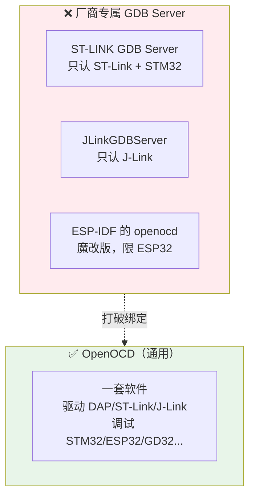
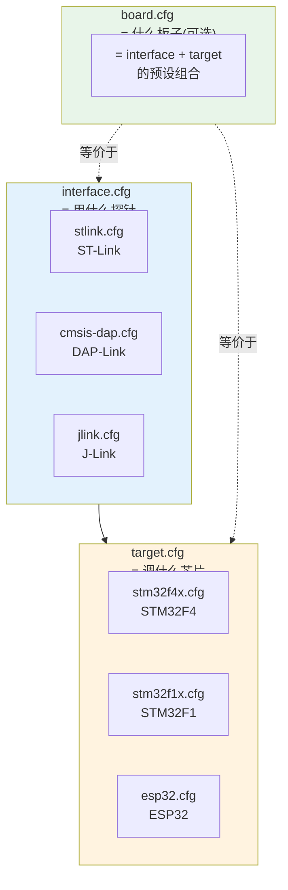
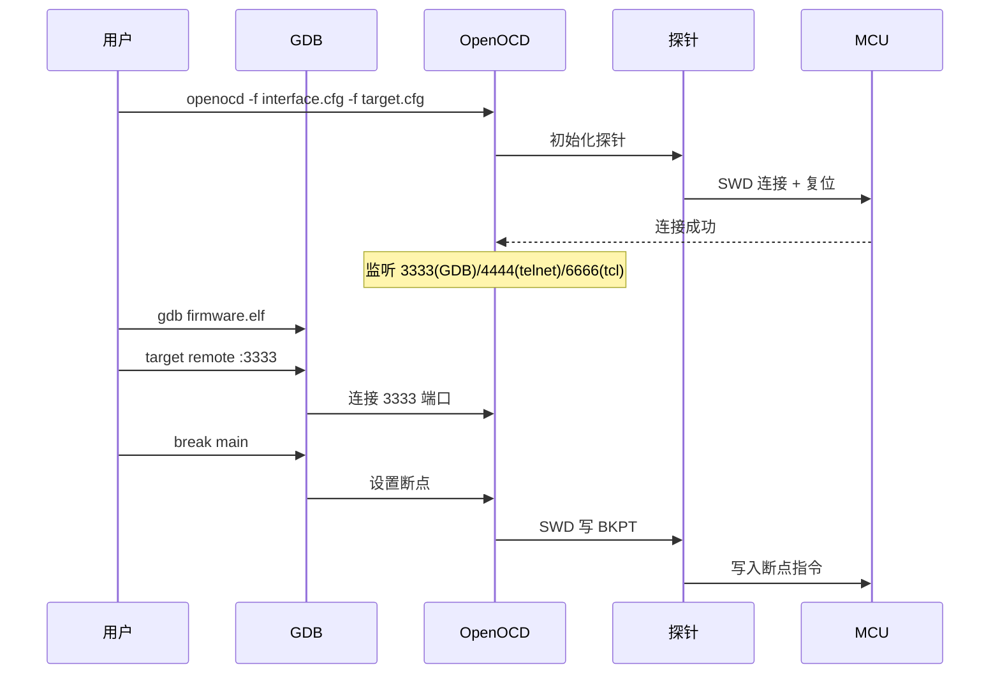
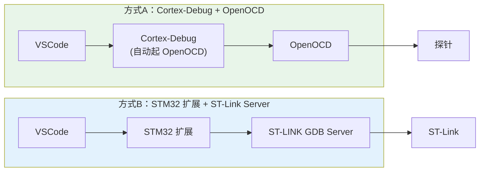

---
aliases:
  - Open On-Chip Debugger
  - GDB Server
  - 调试服务器
tags:
  - 调试/知识体系
  - 调试/工具
  - 开源
date: 2026-06-25
status: 🌿草稿
---

> [!abstract] 核心本质
> OpenOCD 是一个**开源的 GDB Server**：它一头连着各种调试探针（ST-Link/DAP-Link/J-Link），一头用 GDB 远程协议连着 GDB。它的价值是**通用**——同一套软件、同一套配置思路，能驱动几乎所有探针和几乎所有 ARM/RISC-V 芯片，不被厂商工具绑架。

---

## 一、OpenOCD 在链路中的位置


> [!question] 为什么 GDB 不直接连探针？
> GDB 只懂「调试语义」（断点、读内存、单步），不懂「硬件细节」（ST-Link 用什么 USB 端点、SWD 怎么发帧）。
>
> **中间这一层翻译，就是 GDB Server 的职责。** OpenOCD 是开源通用的那一种；厂商的 `ST-LINK GDB Server`、Segger 的 `JLinkGDBServer` 是各自私有的那一种。

---

## 二、为什么需要 OpenOCD（厂商工具 vs 通用工具）



| 维度 | 厂商 GDB Server | OpenOCD |
|------|----------------|---------|
| 探针绑定 | 是（ST-Link Server 只认 ST-Link） | **否**（任意探针） |
| 芯片绑定 | 是（ST 只认 STM32） | **否**（数百种芯片） |
| 开源 | ❌ | ✅ |
| 配置方式 | 向导式 | 文件式（CFG） |
| 跨平台 | 一般 | ✅ 优秀 |
| IDE 兼容 | 偏自家 | Keil/VSCode/Eclipse 通用 |

> [!tip] 类比
> 厂商 GDB Server 像品牌专卖店（只卖自家货），OpenOCD 像大型超市（什么探针芯片都有）。学一套 OpenOCD，走到哪都能用。

---

## 三、三大配置文件：OpenOCD 的核心

OpenOCD 通过**三个配置文件**描述"用什么探针、调什么芯片、什么板子"：



### 3.1 interface.cfg —— 描述探针

```bash
# 告诉 OpenOCD：用 ST-Link，走 SWD
source [find interface/stlink.cfg]
transport select hla_swd   # 选择 SWD 传输
```

### 3.2 target.cfg —— 描述芯片

```bash
# 告诉 OpenOCD：目标芯片是 STM32F407
source [find target/stm32f4x.cfg]
```

芯片配置里定义了：内核类型、Flash/RAM 地址、断点数量、复位方式。

### 3.3 board.cfg —— 预设组合（探针+芯片）

```bash
# 一步到位：板子配置 = 探针 + 芯片
source [find board/stm32f4discovery.cfg]
```

> [!tip] 这些 .cfg 从哪来
> OpenOCD 自带一个 `scripts/` 目录，里面有几百个现成的 `interface/*.cfg`、`target/*.cfg`、`board/*.cfg`。你不用自己写，直接 `source [find ...]` 引用即可。ESP-IDF 也内置了魔改版 OpenOCD 和 `target/esp32.cfg`。

---

## 四、完整工作流程



### 典型启动命令

```bash
# 方式一：命令行指定多个 cfg
openocd -f interface/stlink.cfg \
        -c "transport select hla_swd" \
        -f target/stm32f4x.cfg

# 方式二：用 board 一把梭
openocd -f board/stm32f4discovery.cfg

# 方式三：ESP32（用 idf.py 封装）
idf.py openocd
```

---

## 五、OpenOCD 暴露的三个端口

OpenOCD 启动后会监听三个服务端口：

| 端口 | 协议 | 用途 |
|------|------|------|
| **3333** | GDB Remote | GDB 连这里调试 |
| **4444** | telnet | 命令行手动控制（烧录、读内存） |
| **6666** | TCL | 脚本自动化 |

### telnet 手动控制示例

```bash
# 连上 OpenOCD 的 telnet
telnet localhost 4444

> reset halt        # 复位并暂停 CPU
> flash write_image erase firmware.bin 0x08000000   # 烧录
> mdw 0x20000000 16  # 读 16 个字(内存查看)
> resume             # 继续运行
```

> [!tip] 没有调试器也能烧录
> OpenOCD 本身就能烧录（`flash write_image`），不依赖 GDB。很多 CI/CD 用 OpenOCD + telnet 脚本自动烧录产线固件。

---

## 六、OpenOCD vs Cortex-Debug（VSCode）

在 VSCode 里调试 STM32，常见两种路径：



> [!abstract] 选哪个？
> - **只玩 STM32 + ST-Link** → STM32 扩展的 ST-LINK GDB Server，零配置（见 [[配置文件链路]]）
> - **多芯片/多探针/DAP-Link** → Cortex-Debug + OpenOCD，通用
> - 你笔记里的 `launch.json` 用的 `type: stlinkgdbtarget` 就是方式 B

---

## 七、避坑清单

> [!warning] OpenOCD 常见坑
> 1. **cfg 路径找不到** — 用 `source [find xxx.cfg]` 而非绝对路径，依赖 OpenOCD 的 `scripts/` 搜索路径
> 2. **transport 没选** — 必须 `transport select hla_swd`（或 jtag），否则连不上
> 3. **端口被占用** — 上次 OpenOCD 没退干净，3333 还占着 → 杀进程
> 4. **权限不足（Linux）** — 访问 USB 需要 udev 规则，否则只能 sudo
> 5. **芯片 cfg 选错型号** — `stm32f1x.cfg` 调 F4 会失败，型号要对
> 6. **Flash 烧录地址错** — `flash write_image` 必须带正确基地址（STM32 = 0x08000000）

---

## 🔗 知识延伸

- ⬆️ **上位知识**：[[_MOC-开发流水线总览]]、[[调试全景数据流]]（OpenOCD 是其中的"协议转换"层实现）
- ➡️ **平级关联**：[[探针对比]]（OpenOCD 驱动谁）、[[GDB调试命令手册]]（OpenOCD 服务谁）、[[SWD与JTAG协议]]（OpenOCD 说什么协议）、[[配置文件链路]]
- ⬇️ **下位知识**：pyOCD（Python 版替代品）、JTAG TAP 配置、OpenOCD 脚本编写
