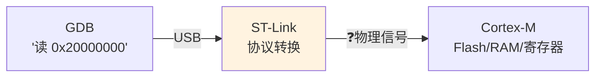
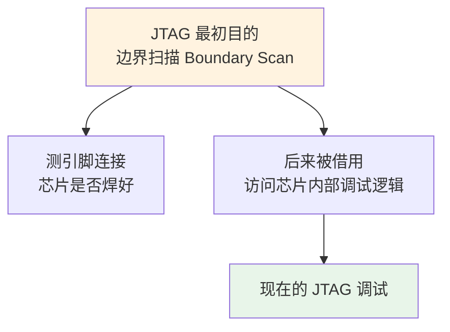
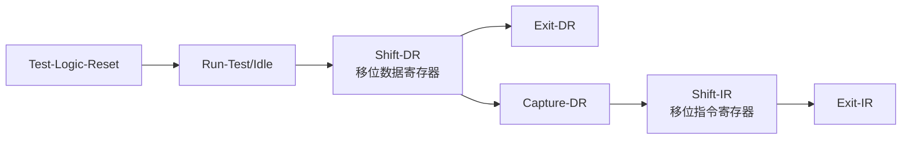
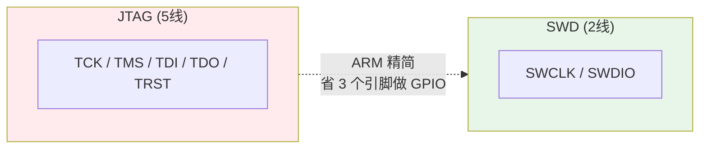
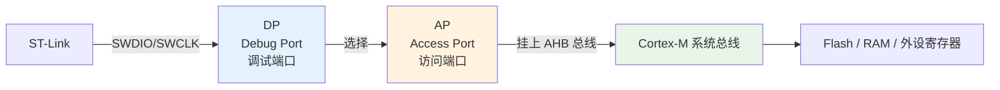
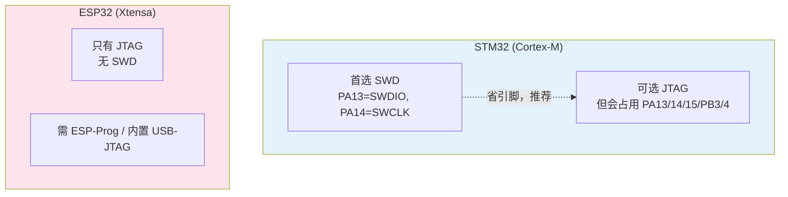

---
aliases:
  - SWD
  - JTAG
  - Serial Wire Debug
  - 调试接口协议
tags:
  - 调试/知识体系
  - 调试/协议
  - Cortex-M
  - Xtensa
date: 2026-06-25
status: 🌿草稿
---

> [!abstract] 核心本质
> SWD / JTAG 是 PC 调试器与 MCU 之间的**物理语言**。JTAG 是老大哥（5 线、状态机复杂、本为边界扫描而生），SWD 是 ARM 为 Cortex-M 设计的**精简方言**（2 线、专门为调试优化）。理解它们，你才能搞懂"凭什么 2 根线就能让 GDB 控制整颗芯片"。

---

## 一、为什么需要调试协议

GDB 在 PC 上，要控制的是 MCU 里的寄存器和 Flash。中间隔着 USB → 调试器 → 芯片，**物理信号**必须有一套约定：



> [!question] 这套"物理信号"叫什么？
> 就是 **SWD / JTAG**。它规定了：
> - 用几根线
> - 每根线干嘛（时钟？数据？）
> - 数据怎么编码成"读地址""写寄存器""暂停 CPU"

调试协议 = **GDB 命令在物理层的执行语言**。

---

## 二、JTAG：老大哥（5 线，本为测试而生）

### 2.1 JTAG 的出身

JTAG（Joint Test Action Group）最早**不是为调试发明的**，而是为**边界扫描**——测电路板上芯片引脚有没有虚焊。



### 2.2 五根线

| 信号 | 方向 | 职责 | 类比 |
|------|------|------|------|
| **TCK** | 调试器→芯片 | 测试时钟 | 节拍器 |
| **TMS** | 调试器→芯片 | 模式选择（控制状态机） | 路标 |
| **TDI** | 调试器→芯片 | 数据输入 | 送货上门 |
| **TDO** | 芯片→调试器 | 数据输出 | 回执单 |
| **TRST** | 调试器→芯片 | 异步复位（可选） | 急停按钮 |

### 2.3 TAP 状态机：JTAG 的核心

JTAG 靠一个 **16 状态的有限状态机（TAP Controller）** 工作。靠 `TMS` 在 `TCK` 跳变时的高低，决定在状态机里怎么走：



> [!tip] 类比
> JTAG 像一个**有 16 个房间的迷宫**。`TMS` 是你手里的地图指令（左转/右转），`TCK` 是每走一步的节拍。只有走到特定房间（Shift-DR），才能从 `TDI` 把数据塞进芯片、从 `TDO` 读出来。

JTAG 复杂，但能访问芯片内部**任何扫描链**（调试、烧录、边界扫描都靠它）。

---

## 三、SWD：ARM 的精简方言（2 线）

### 3.1 为什么要有 SWD

Cortex-M 面向低成本、少引脚的 MCU。JTAG 要 5 根线，**太奢侈**。ARM 设计了 **SWD（Serial Wire Debug）**，只用 2 根线就实现 JTAG 的调试功能：



### 3.2 两根线

| 信号 | 方向 | 职责 |
|------|------|------|
| **SWCLK** | 调试器→芯片 | 时钟（对应 JTAG 的 TCK） |
| **SWDIO** | **双向** | 数据线（既输入又输出） |

> [!warning] SWDIO 是双向的
> 这是 SWD 省线的关键：**一根线分时复用**，先发请求再收应答。代价是协议时序更严格。

### 3.3 读一次寄存器的完整帧

```
请求(8bit) → 应答(3bit) → 数据(32bit) → 奇偶校验(1bit)
  ↓            ↓              ↓
 主机发命令   芯片回状态      芯片回数据/写入数据
```

**请求字段**含义：

| 字段 | 位 | 说明 |
|------|----|------|
| Start | 1 | 起始位（恒 1） |
| APnDP | 1 | 0=访问 DP，1=访问 AP |
| RnW | 1 | 0=写，1=读 |
| Addr | 2 | 寄存器地址 |
| Parity | 1 | 奇偶校验 |
| Park | 1 | 停止位（恒 1） |

---

## 四、SWD 的两层结构：DP 与 AP（核心，必须懂）

这是 SWD 访问 MCU 一切资源的钥匙。SWD 把访问逻辑分成两层：



### 4.1 DP（Debug Port）：协议入口

DP 负责**物理层握手**：管理时钟、应答、选择哪个 AP。

> DP 不直接读内存，它只是"门卫"。

### 4.2 AP（Access Port）：内存访问

AP 才是**真正访问芯片资源**的角色。Cortex-M 上最常见的是 **MEM-AP（AHB-AP）**，它挂到 CPU 的 AHB 总线上。

> [!important] 关键洞察
> 一旦通过 AP 接上 AHB 总线，**调试器就能像 CPU 一样读写所有内存映射**——Flash、RAM、外设寄存器（GPIO/UART/定时器…）。
>
> 这就是为什么 GDB 能"查看任意变量""烧录 Flash""暂停 CPU"——全都是**内存访问**！

### 4.3 类比：去仓库取货

```
DP = 大门保安（核验身份、登记）
AP = 仓库管理员（持有各仓库钥匙）
AHB 总线 = 仓库通道
Flash/RAM/外设 = 各个仓库

调试器取货流程：
  1. 在大门(DP)登记 → 2. 找到管理员(AP) → 3. 经通道(AHB) → 4. 到指定仓库(Flash)取货
```

---

## 五、不同芯片的调试接口选择



> [!tip] 为什么 ESP32 没有 SWD
> SWD 是 **ARM CoreSight** 的私有协议。ESP32 用的是 **Xtensa** 内核，不归属 ARM，所以只能用通用的 JTAG。这也是为什么 ESP32 调试需要 JTAG 调试器（如 ESP-Prog），不能直接用 ST-Link。

### STM32 SWD 引脚（必背）

| 引脚 | 功能 |
|------|------|
| **PA13** | SWDIO |
| **PA14** | SWCLK |
| PA15* | JTAG 的 JTDI（SWD 模式下释放做 GPIO） |
| PB3* | JTAG 的 JTDO |
| PB4* | JTAG 的 JNTRST |

> [!warning] SWD 引脚不能乱用
> 上电默认 PA13/PA14 是 SWD 功能。如果在代码里把这两个引脚配置成普通 GPIO，**下次就再也连不上调试器了**（俗称"锁死"）。救法：用「Connect under reset」连接。

---

## 六、SWD vs JTAG 全面对比

| 维度 | SWD | JTAG |
|------|-----|------|
| **引脚数** | 2（SWCLK+SWDIO） | 5（TCK/TMS/TDI/TDO/TRST） |
| **数据线** | SWDIO 单线双向 | TDI+TDO 分离 |
| **速度** | 较高（精简开销） | 中等 |
| **状态机** | 无（线性帧） | 16 状态 TAP |
| **边界扫描** | ❌ 不支持 | ✅ 支持 |
| **Trace 跟踪** | ✅（配 SWO） | ✅ |
| **占用 GPIO** | 仅 PA13/PA14 | PA13/14/15 + PB3/4 |
| **典型芯片** | Cortex-M 全系列 | 老芯片、Xtensa(ESP32)、Cortex-A |

> [!abstract] 一句话
> **SWD = 为调试而生的精简协议；JTAG = 为测试而生、调试是副业的通用协议。** Cortex-M 用 SWD 省引脚，ESP32/Xtensa 只能用 JTAG。

---

## 七、避坑清单

> [!warning] SWD 连不上调试器的常见原因
> 1. **SWDIO 缺上拉** — SWDIO 必须上拉（板子或芯片内部），否则信号漂浮
> 2. **引脚被代码复用** — 把 PA13/PA14 配成 GPIO → 锁死。救法：「Connect under reset」
> 3. **SWD 频率过高** — 飞线/劣质线缆下降低 `serverInterfaceFrequency`（如 1000→480kHz）
> 4. **复位方式错误** — 程序里时钟配错导致芯片卡死，用 `Connect under reset`（复位时连入）
> 5. **没共地** — 调试器和目标板必须共 GND，飞线调试最易犯
> 6. **JTAG 占用 GPIO** — 用了 JTAG 模式，PA15/PB3/PB4 无法当 GPIO 用

> [!danger] 锁死自救
> 如果你怀疑把 SWD 引脚配置坏了导致连不上：**按住复位 → 连接调试器 → 松开复位**。这就是 `Connect under reset` 的物理含义——在芯片执行你的"坏代码"之前，调试器就接管了。

---

## 🔗 知识延伸

- ⬆️ **上位知识**：[[_MOC-开发流水线总览]]、[[调试全景数据流]]（SWD 是其中的"协议转换"层）
- ➡️ **平级关联**：[[探针对比]]（J-Link/DAP/ST-Link 谁支持什么协议）、[[OpenOCD]]（软件如何驱动 SWD）、[[GDB调试命令手册]]
- ⬇️ **下位知识**：CoreSight 架构、SWO/ITM 跟踪（见 [[Semihosting-ITM-SWO]]）
