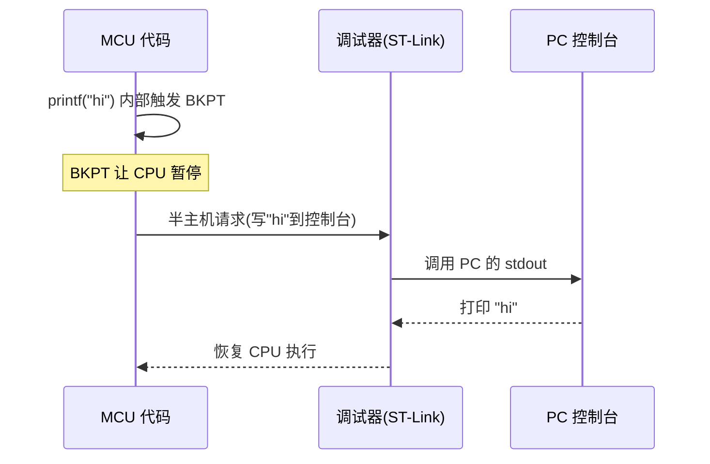
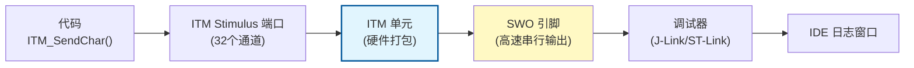
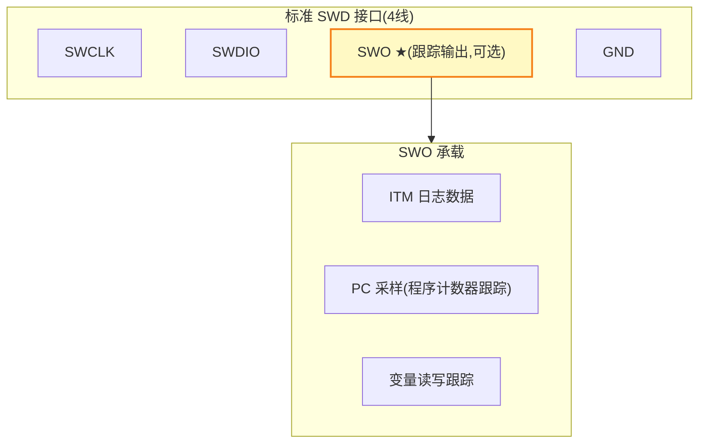
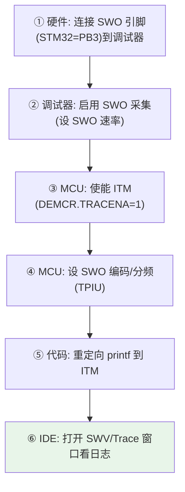
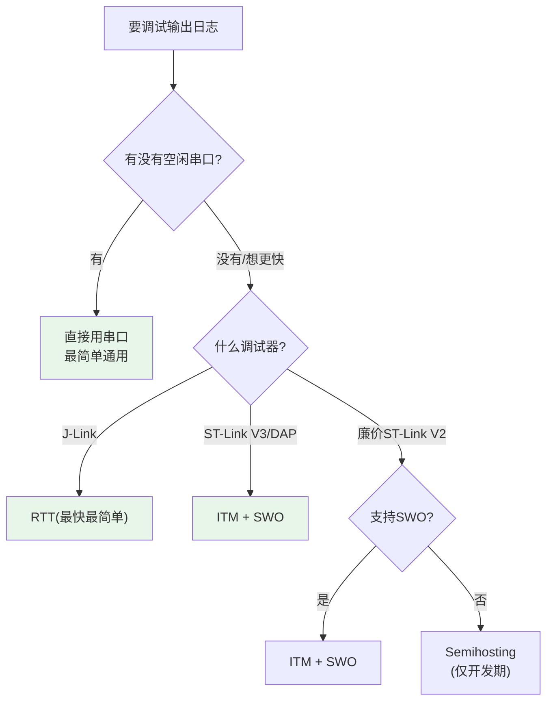

---
aliases:
  - Semihosting
  - ITM
  - SWO
  - 调试跟踪
  - printf 重定向
tags:
  - 调试/知识体系
  - 调试/跟踪
  - Cortex-M
date: 2026-06-25
status: 🌿草稿
---

> [!abstract] 核心本质
> Semihosting / ITM / SWO 是三种**"不占用串口也能输出调试日志"**的技术。它们的共同点：日志通过**调试接口**（SWD/JTAG）送到 PC，不占 UART。区别在**机制与速度**：Semihosting 软件实现（慢，靠 BKPT 陷阱）；ITM 硬件实现（快，靠专用跟踪单元）；SWO 是 ITM 的物理输出线。调试时 printf，这三者比串口优雅得多。

---

## 一、为什么不用串口打印日志


> [!question] 三者到底啥关系
> - **Semihosting** = 让 MCU 借调试器调用 PC 的文件/控制台系统调用（最重，最兼容）
> - **ITM** = Cortex-M 内的硬件日志单元，往专用通道写数据（轻量、快）
> - **SWO** = ITM 数据出来的**那根物理线**（1 根引脚，复用 SWD 接口）

---

## 二、三者全景对比

| 维度 | Semihosting | ITM | 串口(UART) |
|------|-------------|-----|-----------|
| **实现** | 软件(BKPT 陷阱) | 硬件(ITM 单元) | 硬件(UART) |
| **速度** | 慢(每次陷进调试器) | 快(MHz 级) | 中(受波特率限制) |
| **占用引脚** | 0(复用 SWD) | 1(SWO 引脚) | 2(TX/RX) |
| **需要调试器** | ✅ 必须 | ✅ 必须 | ❌ 不需要 |
| **可脱机运行** | ❌(无调试器会卡死) | ❌ | ✅ |
| **中断里用** | ❌(会死锁) | ✅ 安全 | ⚠️(看实现) |
| **支持芯片** | 通用(需库支持) | Cortex-M3+ | 所有 |
| **典型场景** | 早期开发/无串口 | 实时日志 | 量产/现场 |

> [!danger] Semihosting 的致命陷阱
> Semihosting 靠 `BKPT` 指令触发调试器接管。**如果代码里有 Semihosting 但没连调试器**，`BKPT` 触发 HardFault → 死机。所以 Semihosting 代码**绝不能进量产**，必须用宏隔离。

---

## 三、Semihosting：借调试器调 PC 系统调用

### 3.1 原理



> [!tip] 类比
> Semihosting 像**让保安帮你打电话**：你(MCU)不会打电话(没有串口)，但你喊一声(BKPT)，保安(调试器)就用他的电话(PC 控制台)帮你打。代价是每次都要喊保安，慢。

### 3.2 使用方式

```c
// 用 newlib 的 semihosting，初始化 retarget
extern void initialise_monitor_handles(void);
initialise_monitor_handles();   // 重定向 stdin/stdout 到半主机

printf("hello from semihosting\n");   // 输出到调试器控制台
```

链接时需 `-specs=rdimon.specs`（半主机版 libc），而非 `nosys.specs`。

### 3.3 何时用

- 没有可用串口引脚时
- 需要文件读写（半主机支持 `fopen/fread` 读写 PC 文件）
- **绝不用于中断或量产**

---

## 四、ITM：硬件级高速日志（Cortex-M3+ 推荐）

### 4.1 原理



### 4.2 ITM 的优势

- **硬件实现**：不中断 CPU 流水线，不影响时序
- **多通道**：32 个 Stimulus 端口，可区分不同模块日志
- **中断安全**：可在 ISR 里用（不像 Semihosting）
- **可与断点/变量观察同步**：ITM 带时间戳

### 4.3 使用

```c
// 通过 ITM 端口0 输出一个字符
#define ITM_Port32(n) (*((volatile unsigned int *)(0xE0000000+4*n)))

void ITM_SendChar(char c) {
    while (ITM_Port32(0) == 0);   // 等端口就绪
    ITM_Port32(0) = c;
}

// printf 重定向到 ITM
int fputc(int ch, FILE *f) {
    ITM_SendChar(ch);
    return ch;
}
```

> [!tip] J-Link 的 RTT 更香
> J-Link 有自己的 **RTT（Real-Time Transfer）**，比 ITM 更快、配置更简单。如果你用 J-Link，优先 RTT；用 ST-Link 则用 ITM/SWO。

---

## 五、SWO：ITM 的物理输出线

### 5.1 SWO 是什么



> [!important] SWO 的关键
> SWO 是**第 3 根线**（除 SWCLK/SWDIO 外），复用 Cortex-M 的 **TRACEWRK/TRACEDATA** 或专用引脚。STM32 上 SWO 通常是 **PB3**（或可重映射）。
>
> 不是所有调试器都支持 SWO：**J-Link、ST-Link V3、DAP-Link（部分）支持；廉价 ST-Link V2 克隆版可能不支持。**

### 5.2 SWO 采样模式

| 模式 | 时钟 | 要求 |
|------|------|------|
| **Manchester 编码** | 自带时钟 | 兼容性好，速度低 |
| **UART/NRZ 编码** | 需配 SWO 速率 = CPU 时钟/N | 速度快，需精确配速 |

---

## 六、配置流程（以 ITM+SWO 为例）



### STM32 关键寄存器配置

```c
#define DEMCR    (*(volatile uint32_t *)0xE000EDFC)
#define ITM_LAR  (*(volatile uint32_t *)0xE0000FB0)

void ITM_Init(void) {
    DEMCR |= (1 << 24);            // TRACENA 使能跟踪
    ITM_LAR = 0xC5ACCE55;          // 解锁 ITM
    // 配置 Stimulus 端口0 使能...
}
```

---

## 七、选型决策



---

## 八、避坑清单

> [!warning] 跟踪技术常见坑
> 1. **Semihosting 进了量产** — 无调试器时 `BKPT` 触发 HardFault，务必用 `#ifdef DEBUG` 隔离
> 2. **SWO 速率配错** — NRZ 模式下 SWO 速率必须与 CPU 时钟匹配，否则乱码
> 3. **廉价 ST-Link 不支持 SWO** — 克隆版 ST-Link V2 经常砍了 SWO，输出无反应
> 4. **ITM 在 Cortex-M0 不可用** — ITM 需要 **M3/M4/M7**，M0/M0+ 只有简化版
> 5. **中断里 Semihosting 死锁** — Semihosting 暂停 CPU，中断里用会永久卡住
> 6. **SWO 引脚被复用** — PB3 默认是 JTAG 的 JTDO，要先释放

---

## 🔗 知识延伸

- ⬆️ **上位知识**：[[_MOC-开发流水线总览]]、[[调试全景数据流]]
- ➡️ **平级关联**：[[SWD与JTAG协议]]（SWO 复用 SWD 接口）、[[探针对比]]（谁支持 SWO）、[[HardFault排查实战]]（ITM 可安全输出崩溃日志）
- ⬇️ **下位知识**：J-Link RTT、ETM（指令跟踪，比 ITM 更全）、DEMCR/TPIU 寄存器详解
