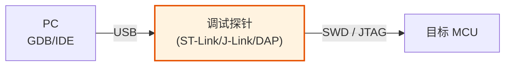
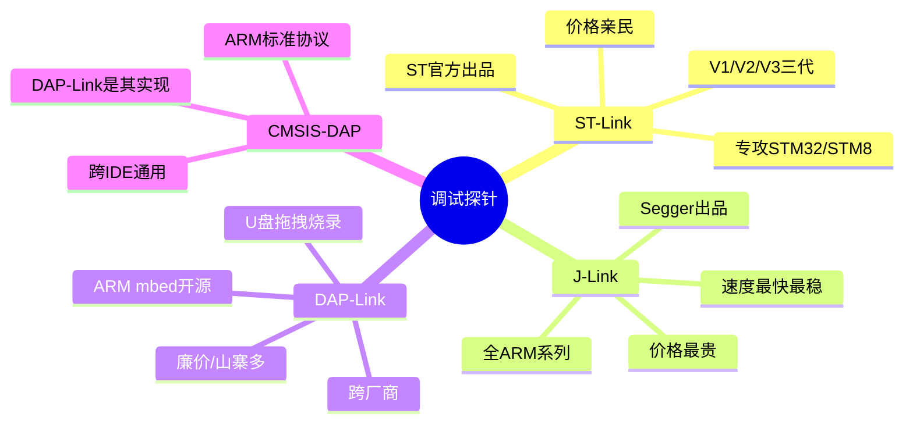
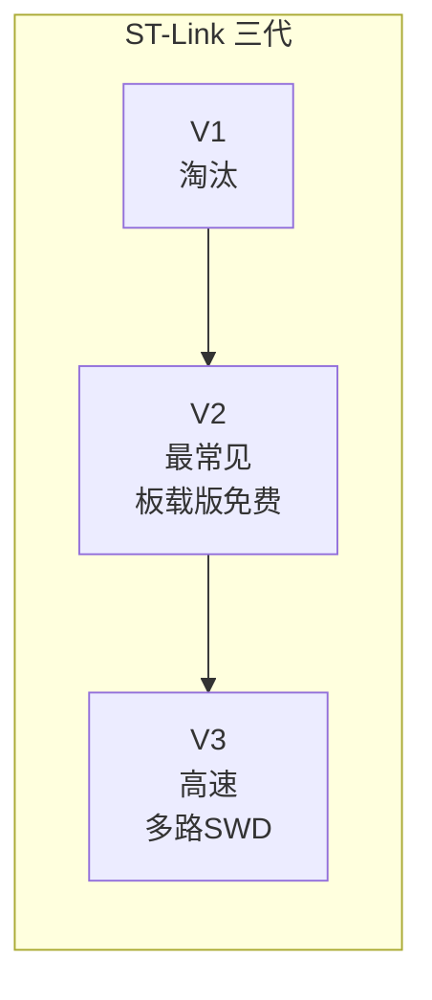
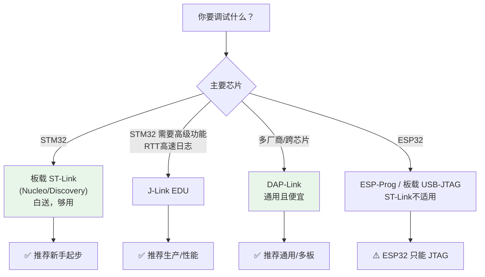
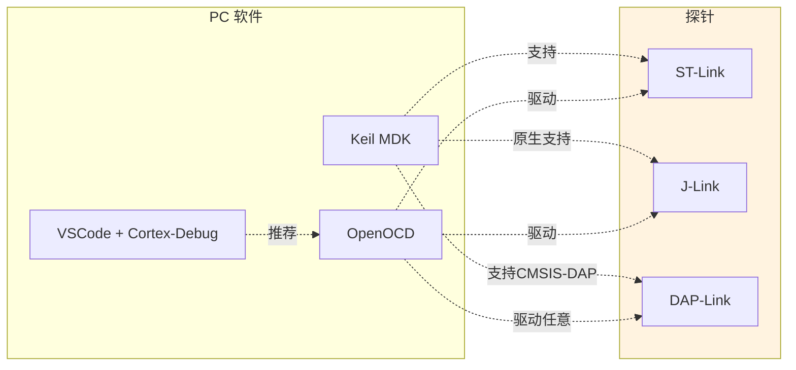

---
aliases:
  - 调试探针
  - Debug Probe
  - ST-Link vs J-Link
  - DAP-Link
tags:
  - 调试/知识体系
  - 调试/工具
date: 2026-06-25
status: 🌿草稿
---

> [!abstract] 核心本质
> 调试探针（Debug Probe）是 **USB 与 SWD/JTAG 之间的翻译器**：把 PC 的 USB 命令翻译成芯片听得懂的 SWD/JTAG 信号。不同探针的差别，本质是**支持的协议、芯片广度、速度、价格**的权衡。理解这张选型表，你买设备时就不会踩坑。

---

## 一、调试探针在链路中的位置

> [!question] 探针到底在干什么？
> 1. **协议转换**：USB（PC 懂）↔ SWD/JTAG（芯片懂）
> 2. **电平适配**：USB 的 5V ↔ MCU 的 3.3V
> 3. **时钟生成**：产生 SWCLK/TCK
> 4. **提供 GDB Server**：很多探针自带服务，让 GDB 远程连入

---

## 二、四大主流探针

### 2.1 ST-Link —— ST 官方，STM32 专精

| 维度 | 说明 |
|------|------|
| **出身** | ST 官方，为 STM32/STM8 量身定做 |
| **支持芯片** | STM32（最佳）、STM8，**部分**支持其他 ARM（需 ST 软件） |
| **协议** | SWD + JTAG + SWV（跟踪） |
| **驱动** | Windows 自动；Linux 需 `libusb`/`stlink`；macOS 需配置 |
| **价格** | 板载版（Discovery/Nucleo 板上自带的）≈ 免费；独立版几十元；V3 几百元 |
| **附加** | 虚拟串口（VCP）、SWO 跟踪 |

> [!tip] 板载 ST-Link 的妙用
> 买一块带板载 ST-Link 的开发板（如 Nucleo），等于白送一个 ST-Link，还能当 USB-TTL 串口用。新手最划算的入门选择。

### 2.2 J-Link —— Segger 出品，全 ARM 之王

| 维度 | 说明 |
|------|------|
| **出身** | Segger，第三方，但支持**几乎所有 ARM Cortex 内核** |
| **支持芯片** | 全 ARM（Cortex-M0~M85、Cortex-A）、RISC-V（新版） |
| **协议** | SWD + JTAG + cJTAG，速度最高 |
| **驱动** | 自带 J-Link Driver，跨平台稳定 |
| **价格** | 教育版（EDU）几百元；正版数千元；山寨版几十元（⚠️ 驱动会被 Segger 封杀） |
| **附加** | RTT（实时日志，极快）、SWO、最高速烧录 |

> [!warning] 山寨 J-Link 的坑
> Segger 会**检测山寨版并拒绝升级/运行**。买廉价"J-Link"很可能是山寨，某天升级固件后直接变砖。生产环境务必用正版或 ST-Link/DAP-Link。

### 2.3 DAP-Link —— ARM 开源，跨厂商

| 维度 | 说明 |
|------|------|
| **出身** | ARM mbed 项目开源，前身叫 mbed CMSIS-DAP |
| **支持芯片** | **跨厂商**：STM32/NXP/Nordic/GD32 等几乎所有 ARM |
| **协议** | 实现 **CMSIS-DAP** 标准 |
| **驱动** | 免驱（HID），跨平台无需装驱动 |
| **价格** | 几十元；可自己用 STM32F103 烧 DAPLink 固件自制 |
| **附加** | **U盘拖拽烧录**（把 .hex 拖进 U 盘就烧录）、虚拟串口 |

> [!tip] DAP-Link 的杀手锏
> 插上电脑识别成**一个 U 盘 + 一个串口**。把 `firmware.hex` 拖进 U 盘，自动烧录——无需任何软件。新手友好度拉满，且跨厂商通用。

### 2.4 CMSIS-DAP —— 不是探针，是标准

> [!important] 澄清误区
> **CMSIS-DAP 是 ARM 制定的协议标准，不是某个具体探针。** DAP-Link 是它的开源实现；很多探针（如 Atmel ICE、Keil ULINK）也兼容 CMSIS-DAP。

CMSIS-DAP 的价值：**跨 IDE 通用**。任何支持 CMSIS-DAP 的工具（Keil/VSCode/OpenOCD/pyOCD）都能驱动任何兼容探针，不绑定厂商。

---

## 三、四大探针对比表

| 维度 | ST-Link | J-Link | DAP-Link |
|------|---------|--------|----------|
| **厂商** | ST 官方 | Segger | ARM 开源 |
| **支持芯片** | ST 为主 | 全 ARM | 全 ARM |
| **协议** | SWD/JTAG/SWV | SWD/JTAG/RTT | CMSIS-DAP |
| **烧录速度** | 中 | 最快 | 慢-中 |
| **稳定性** | 高 | 最高 | 中 |
| **驱动** | 需安装 | 需安装 | 免驱 HID |
| **跨 IDE** | 偏 ST 工具 | 通用 | 最通用 |
| **价格** | 低-中 | 高 | 最低 |
| **开源** | ❌ 闭源 | ❌ 闭源 | ✅ 完全开源 |
| **附加** | VCP/SWO | RTT(超快日志) | U盘烧录/VCP |

---

## 四、选型决策树

---

## 五、烧录与调试的"全家桶"组合

> [!tip] 经验法则
> - **Keil 用户**：J-Link 体验最好，ST-Link 次之
> - **VSCode/GCC 工具链用户**：OpenOCD + DAP-Link/ST-Link，最灵活
> - **跨厂商/多板调试**：DAP-Link + OpenOCD/pyOCD
> - **ESP32**：ESP-Prog 或板载 USB-JTAG（见 [[ESP32调试]]）

---

## 六、避坑清单

> [!warning] 探针常见坑
> 1. **ST-Link 固件版本不匹配** — STM32CubeProgrammer 升级 ST-Link 固件后再用
> 2. **多探针冲突** — 同时插多个探针，用序列号区分（`serverSerialNumber`）
> 3. **DAP-Link 山寨版** — 廉价版可能刷了残缺固件，烧录不稳；建议自己用 F103 刷官方 DAPLink
> 4. **J-Link 山寨被锁** — Segger 升级会封杀山寨，正版或用替代品
> 5. **3.3V 上拉缺失** — SWDIO/JTAG 的 TMS 需上拉，劣质探针不带会导致时断时续
> 6. **不共地** — 探针和目标板 GND 必须连，飞线最易忘

---

## 🔗 知识延伸

- ⬆️ **上位知识**：[[_MOC-开发流水线总览]]、[[调试全景数据流]]
- ➡️ **平级关联**：[[SWD与JTAG协议]]（探针用什么协议说话）、[[OpenOCD]]（软件如何驱动探针）、[[GDB调试命令手册]]
- ⬇️ **下位知识**：J-Link RTT 实时日志、ST-Link 固件升级流程
