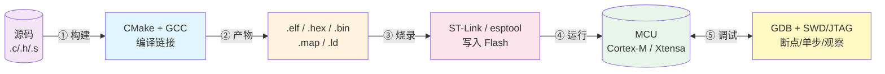
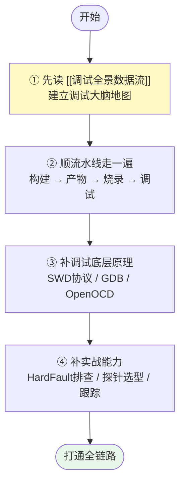

---
aliases:
  - 开发流水线
  - 工具链总览
  - 构建-烧录-调试总览
tags:
  - 调试/知识体系
  - MOC
  - 嵌入式/工具链
date: 2026-06-25
status: 🌿草稿
---

> [!abstract] 核心本质
> 嵌入式开发从「写一行代码」到「在芯片上看到效果」，本质上经过一条**五段流水线**：源码 → 构建 → 产物 → 烧录 → 调试。每一阶段都有专属工具和原理，前一阶段的输出就是后一阶段的输入。理解这条链路，你才能在"烧不进去""跑不起来""符号找不到"面前游刃有余，而不是把每个环节当成黑箱。

---

## 一、流水线全景图

---

## 二、四阶段导航

### 10 · 构建 Build — 「代码怎么变成固件」

> [!info] 这阶段回答
> 编译器在哪？配置文件怎么分工？团队协作如何零配置？

- [[CMake]] — 构建系统生成器（CMakeLists.txt 本质、三层架构、编写规范）
- [[配置文件链路]] — VSCode ↔ CMake ↔ 脚本 的分层解耦设计

### 20 · 产物 Artifacts — 「固件文件长什么样」

> [!info] 这阶段回答
> .elf / .hex / .bin 有什么区别？调试信息和烧录信息怎么分家？

- [[文件格式]] — elf/hex/bin 深度剖析 + 全景文件格式 + 选型决策树

### 30 · 烧录 Flash — 「固件怎么写进芯片」

> [!info] 这阶段回答
> 烧录地址从哪来？为什么烧 Flash 需要算法？没有调试器怎么烧？芯片砖了怎么救？

**原理**
- [[烧录原理与下载算法]] — ★鸡生蛋难题、Flash Loader、RAM 执行、FLM 文件
- [[ESP32-D0WDQ6的启动流程和内存详细]] — Flash/SRAM/ROM/PSRAM 分区布局（烧录地址的根）
- [[sdkconfig]] — ESP-IDF 配置如何决定固件形态与烧录参数

**工具与命令**
- [[烧录工具与命令]] — ★STM32CubeProgrammer CLI / esptool.py 实战 + 量产脚本
- [[基础指令]] — idf.py 全套命令（环境/项目/编译/串口/烧录）

**ISP 与救砖**
- [[ISP与救砖]] — ★STM32(BOOT0)/ESP32(GPIO0)/CH552(USB) 三种 ISP + 救砖大全

### 40 · 调试 Debug — 「程序怎么在芯片上被你控制」

> [!info] 这阶段回答
> 断点为什么能让 CPU 停下？符号文件为什么必须匹配？崩溃怎么定位？

**基础认知**
- [[调试全景数据流]] — ★调试链路大脑地图（ELF/SWD/GDB/ST-Link 五层模型）
- [[Cortex-M4 核心寄存器与调用栈]] — PC/LR/SP + 栈机制 + 断点原理 + HardFault 定位

**协议与工具**
- [[SWD与JTAG协议]] — DP/AP、SWD vs JTAG、2 线如何调试（协议底层）
- [[探针对比]] — J-Link / DAP-Link / CMSIS-DAP / ST-Link 选型
- [[OpenOCD]] — 开源 GDB Server、interface/target/board 配置
- [[GDB调试命令手册]] — 断点/单步/查看/调用栈实战命令

**实战能力**
- [[HardFault排查实战]] — CFSR/HFSR 解读、栈回溯定位崩溃
- [[Semihosting-ITM-SWO]] — 调试接口输出日志、printf 重定向

**平台**
- [[ESP32调试]] — ESP_LOG 日志、panic 排查、idf.py gdb（日志驱动 + 崩溃定位）

---

## 三、学习路径建议

> [!tip] 新手最优顺序
> 不要一上来啃 SWD 协议。先从 `调试全景数据流` 建立宏观认知，知道"调试是一条链路"，再逐个环节深入。这条链路上任何一环断了（符号不匹配、SWD 连不上、地址烧错），现象都是"调不动"——而你能立刻定位是哪一环。

---

## 四、知识地图与补全状态

> [!success] 四阶段流水线已全部建成
> - **10 · 构建**：CMake + 配置文件链路（原内容清理去重完成）
> - **20 · 产物**：elf/hex/bin 文件格式（已补 frontmatter 收尾）
> - **30 · 烧录**：原理 + 工具 + ISP 救砖 三篇新增（批次4 完成）
> - **40 · 调试**：6 篇高优先级知识 + 基础认知 + ESP32 平台（批次3 完成）

**可选的后续补全（非阻塞）**

- [[断点与观察点]] — 从 [[Cortex-M4 核心寄存器与调用栈]] 拆出独立 + DWT/FPB 补全
- [[链接脚本解析]] — `.ld` 文件、段布局、`._user_heap_stack`（补断链）
- [[Ninja]] — 高速构建系统（补断链）

---

## 五、断链修复状态

> [!success] 大部分断链已通过批次3补全接上
> - ✅ `[[SWD协议]]` `[[SWD接口]]` → 已有 [[SWD与JTAG协议]]
> - ✅ `[[GDB命令手册]]` `[[GDB调试命令大全]]` → 已有 [[GDB调试命令手册]]
> - ✅ `[[HardFault排查]]` `[[HardFault排查实战]]` → 已有 [[HardFault排查实战]]
> - ✅ `[[GDB Server]]` `[[ST-LINK调试器]]` → 已有 [[OpenOCD]] / [[探针对比]]
> - ⏳ `[[链接脚本解析]]` — 待补（.ld 文件解析）
> - ⏳ `[[Ninja]]` — 待补（构建系统）

---

## 🔗 知识延伸

- ⬆️ **上位知识**：[[嵌入式开发工具链]]、嵌入式工程实践总览
- ➡️ **平级关联**：[[嵌入式/芯片]]（Cortex-M4 / Xtensa 架构）、[[内存]]（存储器认知）、[[中断]]（HardFault 本质是异常）
- 📁 **本模块根目录**：`调试烧录-知识/`（按 10/20/30/40 四阶段组织）
