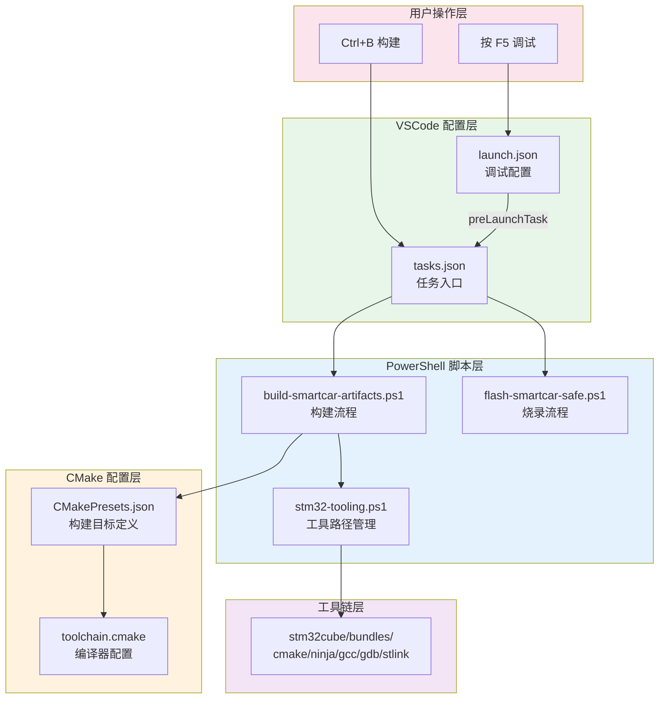
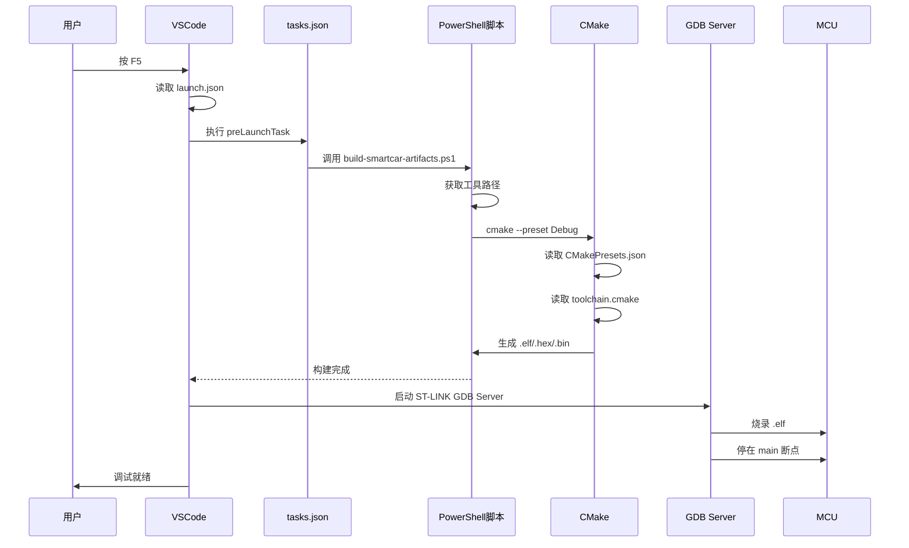

# 配置文件链路：从原理到实战

---

## 核心摘要

> [!abstract] 核心本质
> 嵌入式工程的配置体系采用**分层解耦**设计：VSCode 层负责用户交互入口，脚本层负责流程控制与工具管理，CMake 层负责编译配置。通过 PowerShell 脚本动态获取工具路径，实现"零配置"的团队协作体验。

---

## 一、理论篇：三个核心问题

### 1.1 问题一：编译器路径怎么找？

当团队中每个人安装工具链的路径不同时，如何保证构建一致性？

| 方案 | 问题 |
|------|------|
| 系统环境变量 PATH | 多版本冲突、不同项目需求不同、新人上手成本高 |
| CMakeLists.txt 写死 | Git 冲突、容易误提交本地路径 |
| **脚本动态获取** ✅ | 统一从 bundles 目录获取，自动选最新版本 |

### 1.2 问题二：配置文件怎么分工？

| 配置文件 | 类比 | 职责 |
|----------|------|------|
| `toolchain.cmake` | 工具箱说明书 | 编译器叫什么、有什么能力、目标平台是什么 |
| `CMakePresets.json` | 工作订单 | 选择哪个工具箱、做什么任务、输出放哪里 |
| `launch.json` | 调试指令 | 用哪个调试器、调试哪个文件、怎么连接芯片 |
| `tasks.json` | 任务入口 | 封装构建/烧录/检查等自动化任务 |

### 1.3 问题三：配置之间怎么关联？

**硬编码路径的问题：**

```json
// launch.json 写死了路径
"imageFileName": "${workspaceFolder}/build/Debug/Smartcar_V1.elf"

// 如果 CMakePresets.json 改了输出目录
"binaryDir": "${sourceDir}/build/release"

// 结果：launch.json 找不到文件！
```

**解决方案：动态变量关联**

```json
// 使用 CMake Tools 扩展提供的变量
"imageFileName": "${command:cmake.launchTargetPath}"
```

这个变量会自动读取当前选中的 CMake Preset，找到对应的输出文件路径。

---

## 二、架构篇：配置体系全景图

### 2.1 分层架构



### 2.2 调用链路



---

## 三、实战篇：各配置文件详解

### 3.1 CMakePresets.json

**职责：** 定义构建目标（Debug/Release）、选择工具链文件、指定输出目录

```json
{
  "version": 3,
  "configurePresets": [
    {
      "name": "Debug",
      "displayName": "Debug Build",
      "toolchainFile": "cmake/toolchain.cmake",
      "binaryDir": "${sourceDir}/build/Debug",
      "cacheVariables": {
        "CMAKE_BUILD_TYPE": "Debug"
      }
    },
    {
      "name": "Release",
      "displayName": "Release Build",
      "toolchainFile": "cmake/toolchain.cmake",
      "binaryDir": "${sourceDir}/build/Release",
      "cacheVariables": {
        "CMAKE_BUILD_TYPE": "Release"
      }
    }
  ]
}
```

**关键设计：**
- `toolchainFile`：指定工具链文件路径
- `binaryDir`：构建输出目录，不同 Preset 输出到不同目录
- `cacheVariables`：传递给 CMake 的变量

### 3.2 toolchain.cmake

**职责：** 定义编译器名称、CPU 参数、链接选项

```cmake
# 编译器前缀
set(TOOLCHAIN_PREFIX arm-none-eabi-)

# 编译器路径（如果不在 PATH 中，需要指定完整路径）
set(CMAKE_C_COMPILER ${TOOLCHAIN_PREFIX}gcc)
set(CMAKE_CXX_COMPILER ${TOOLCHAIN_PREFIX}g++)
set(CMAKE_ASM_COMPILER ${TOOLCHAIN_PREFIX}gcc)

# CPU 参数
set(CPU_PARAMETERS
    -mcpu=cortex-m4
    -mfpu=fpv4-sp-d16
    -mfloat-abi=hard
    -mthumb
)

# 编译选项
add_compile_options(
    ${CPU_PARAMETERS}
    -Wall
    -Wextra
    -ffunction-sections
    -fdata-sections
)

# 链接选项
add_link_options(
    ${CPU_PARAMETERS}
    -specs=nano.specs
    -specs=nosys.specs
    -Wl,--gc-sections
)
```

**关键设计：**
- 只定义编译器**名称**，不定义**路径**（路径由脚本动态获取）
- CPU/FPU 参数集中管理，便于切换芯片

### 3.3 launch.json

**职责：** 定义调试器类型、目标芯片、ELF 路径、连接方式

```json
{
  "version": "0.2.0",
  "configurations": [
    {
      "name": "STM32Cube: Debug Smartcar_V1 (ST-LINK)",
      "type": "stlinkgdbtarget",
      "request": "launch",
      
      // 构建依赖
      "preLaunchTask": "smartcar:build Debug",
      
      // 目标芯片
      "deviceName": "STM32F407ZG",
      "deviceCore": "Cortex-M4",
      
      // ELF 文件（动态关联）
      "imagesAndSymbols": [{
        "imageFileName": "${command:cmake.launchTargetPath}",
        "symbolFileName": "${command:cmake.launchTargetPath}"
      }],
      
      // 调试接口
      "serverInterface": "SWD",
      "serverInterfaceFrequency": "1000",
      
      // ST-LINK 序列号（多调试器时区分）
      "serverSerialNumber": "48FF6A067788494832111267",
      
      // 复位方式
      "serverReset": "Connect under reset",
      
      // 入口点
      "runEntry": "main"
    }
  ]
}
```

**关键设计：**
- `preLaunchTask`：调试前自动构建，确保 ELF 最新
- `${command:cmake.launchTargetPath}`：动态获取 ELF 路径，与 CMake Preset 自动关联
- `serverSerialNumber`：多调试器环境下区分设备

### 3.4 tasks.json

**职责：** 封装 PowerShell 脚本，提供构建/烧录/检查任务入口

```json
{
  "version": "2.0.0",
  "tasks": [
    {
      "label": "smartcar:build Debug",
      "type": "shell",
      "command": "powershell.exe",
      "args": [
        "-NoProfile",
        "-ExecutionPolicy", "Bypass",
        "-File", ".\\tools\\build-smartcar-artifacts.ps1",
        "-BuildPreset", "Debug"
      ],
      "options": {
        "cwd": "${workspaceFolder}"
      }
    },
    {
      "label": "smartcar:flash safe",
      "type": "shell",
      "command": "powershell.exe",
      "args": [
        "-NoProfile",
        "-ExecutionPolicy", "Bypass",
        "-File", ".\\tools\\flash-smartcar-safe.ps1",
        "-BuildPreset", "Debug"
      ]
    }
  ]
}
```

**关键设计：**
- 封装复杂脚本，VSCode 只需引用任务名
- `-BuildPreset` 参数传递构建类型

### 3.5 stm32-tooling.ps1

**职责：** 动态获取工具链路径，实现零配置

```powershell
function Get-Stm32ToolPaths {
    # 获取工具包根目录
    $bundleRoot = Get-Stm32BundleRoot  # %LOCALAPPDATA%\stm32cube\bundles
    
    # 动态获取各工具的最新版本
    $cmakeBin = Get-Stm32LatestBundleBin -BundleName "cmake"
    $ninjaBin = Get-Stm32LatestBundleBin -BundleName "ninja"
    $gccBin = Get-Stm32LatestBundleBin -BundleName "gnu-tools-for-stm32"
    $gdbBin = Get-Stm32LatestBundleBin -BundleName "gnu-gdb-for-stm32"
    $stlinkBin = Get-Stm32LatestBundleBin -BundleName "stlink-gdbserver"
    
    return [pscustomobject]@{
        CMakePath = Join-Path $cmakeBin "cmake.exe"
        NinjaPath = Join-Path $ninjaBin "ninja.exe"
        ObjcopyPath = Join-Path $gccBin "arm-none-eabi-objcopy.exe"
        ProgrammerCliPath = Join-Path $programmerBin "STM32_Programmer_CLI.exe"
    }
}
```

**工具包目录结构：**

```
%LOCALAPPDATA%\stm32cube\bundles\
├── cmake\
│   ├── 3.28.0\bin\
│   └── 3.30.0\bin\      ← 自动选最新
├── ninja\
│   └── 1.12.0\bin\
├── gnu-tools-for-stm32\
│   ├── 10.3-2021.10\bin\
│   └── 11.3-2022.07\bin\  ← 自动选最新
├── stlink-gdbserver\
│   └── 2.1.0\bin\
└── programmer\
    └── 2.13.0\bin\
```

**关键设计：**
- 统一从 STM32Cube VSCode 扩展安装的 bundles 获取
- 自动选择最新版本，团队工具链一致
- 无需手动配置环境变量

### 3.6 build-smartcar-artifacts.ps1

**职责：** 完整构建流程（配置 → 编译 → 生成 hex/bin → 验证）

```powershell
param([string]$BuildPreset = "Debug")

# 1. 引入工具函数
. (Join-Path $PSScriptRoot "stm32-tooling.ps1")

# 2. 获取工具路径
$toolPaths = Add-Stm32ToolPathsToEnvironment

# 3. 配置（如果 build.ninja 不存在）
if (-not (Test-Path "build.ninja")) {
    & $toolPaths.CMakePath --preset $BuildPreset
}

# 4. 构建
& $toolPaths.CMakePath --build --preset $BuildPreset

# 5. 生成 hex/bin
& $toolPaths.ObjcopyPath -O ihex $elfPath $hexPath
& $toolPaths.ObjcopyPath -O binary $elfPath $binPath

# 6. 验证
if ($hexItem.LastWriteTime -lt $elfItem.LastWriteTime) {
    throw "HEX is older than ELF!"
}
```

**关键设计：**
- 每一步都有错误检查（`$LASTEXITCODE`）
- 验证输出文件时间戳，确保一致性

---

## 四、职责速查表

| 配置文件 | 职责 | 触发方式 | 维护方式 |
|----------|------|----------|----------|
| [[CMakePresets.json]] | 构建目标定义 | `cmake --preset` | 提交 Git |
| [[toolchain.cmake]] | 编译器配置 | CMakePresets 引用 | 提交 Git |
| [[launch.json]] | 调试配置 | F5 触发 | 提交 Git |
| [[tasks.json]] | 任务入口 | preLaunchTask 引用 | 提交 Git |
| `stm32-tooling.ps1` | 工具路径管理 | 脚本引用 | 提交 Git |
| `build-*.ps1` | 构建流程 | tasks.json 调用 | 提交 Git |
| `CMakeUserPresets.json` | 个人本地配置 | 自动合并 | **不提交 Git** |

---

## 五、常见操作指南

### 5.1 新人入职：环境搭建

```
1. 安装 VSCode
2. 安装 STM32 VSCode 扩展（自动安装 cmake/ninja/gcc/gdb 到 bundles）
3. 克隆项目代码
4. 按 F5 调试 → 自动构建 → 自动烧录 → 停在 main
```

**无需任何手动配置！**

### 5.2 切换构建类型

**方式一：修改 launch.json**

```json
"preLaunchTask": "smartcar:build Release"
```

**方式二：VSCode 状态栏**

点击底部状态栏的 CMake Preset 选择器，切换当前激活的 Preset。

### 5.3 添加新芯片支持

**步骤：**

1. 新建 `cmake/toolchain-stm32f103.cmake`
2. 在 `CMakePresets.json` 添加新 Preset
3. 在 `tasks.json` 添加新构建任务
4. 在 `launch.json` 添加新调试配置

---

## 六、避坑指南

> [!warning] 路径硬编码陷阱
> 不要在 launch.json 里写死 ELF 路径，使用 `${command:cmake.launchTargetPath}` 动态关联。

> [!warning] 环境变量依赖陷阱
> 不要依赖系统环境变量 PATH，脚本会自动管理工具路径。

> [!warning] Git 冲突陷阱
> `CMakeUserPresets.json` 用于个人本地配置，不要提交到 Git。

> [!warning] 构建类型不一致
> 确保 launch.json 的 preLaunchTask 与当前选中的 CMake Preset 一致。

---

## 七、知识延伸

### 🔗 知识网络

- ⬆️ **上位知识**：[[嵌入式开发工具链知识体系]]、[[CMake]]
- ⬇️ **下位知识**：[[toolchain.cmake 编写规范]]、[[PowerShell 脚本设计模式]]
- ➡️ **平级关联**：[[ELF文件结构]]、[[GDB调试原理]]、[[ST-LINK调试器]]

### 核心概念链接

- [CMake](CMake.md)：构建系统生成器
- [[Ninja]]：高速构建系统
- [Cortex-M4 核心寄存器与调用栈](Cmake-STM/Cortex-M4%20核心寄存器与调用栈.md)
- [[SWD接口]]：Serial Wire Debug，ARM 调试接口
- [[GDB Server]]：远程调试代理
- [文件格式](文件格式.md)
- [把原理映射到你工程配置（launch.json、CMakePresets、工具链），@20260403_123123](../copilot/copilot-conversations/把原理映射到你工程配置（launch.json、CMakePresets、工具链），@20260403_123123.md)